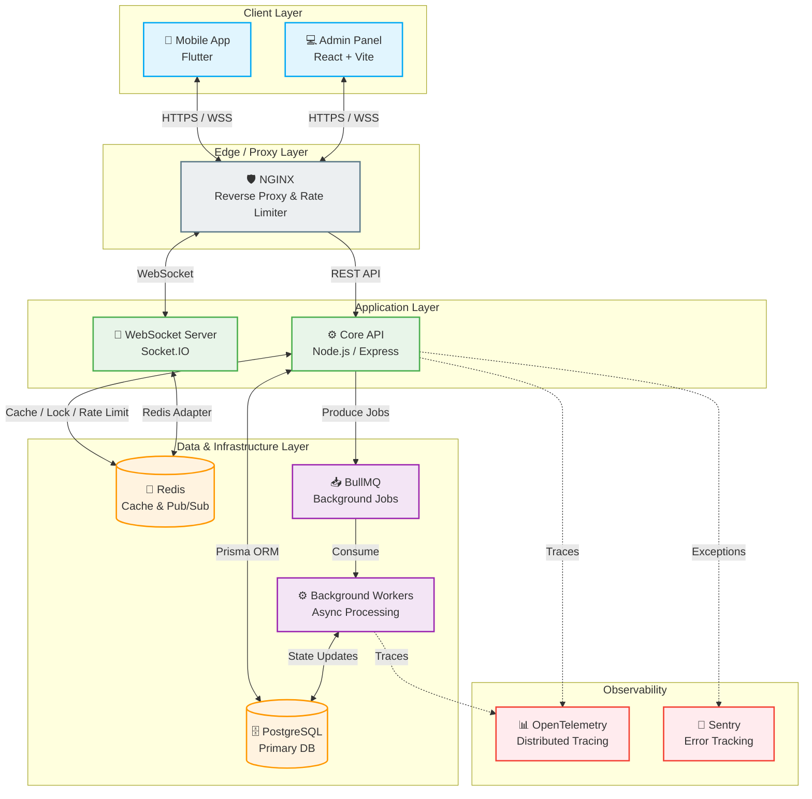

<div align="center">
  
  <h1>Al-Markazia Enterprise System</h1>
  <p><strong>A Next-Generation, Multi-Tenant Restaurant & Logistics Management Platform</strong></p>

  <p>
    <a href="#-architecture"></a>
    <a href="#-security"></a>
    <a href="#-tech-stack"></a>
    <a href="#-tech-stack"></a>
    <a href="#-tech-stack"></a>
  </p>
</div>

<br/>

## 📖 Overview

**Al-Markazia** is a high-performance, enterprise-grade restaurant management and logistics system designed to handle multi-branch operations, real-time order tracking, and complex financial transactions at scale.

Built with a focus on **reliability**, **security**, and **real-time synchronization**, the system provides a seamless experience across its three main pillars:
1. **High-Performance Core API:** Event-driven backend capable of handling massive concurrency.
2. **Real-time Admin Dashboard:** Centralized control room for multi-branch management.
3. **Customer Mobile Application:** A rich, responsive mobile experience.

---

## 🏗️ System Architecture

The platform utilizes a robust Event-Driven Architecture (EDA) integrated with CQRS and Outbox patterns to ensure data consistency and system resilience under high loads.



---

## ✨ Key Enterprise Features

### 🛡️ Uncompromising Security
- **Asymmetric JWT Authentication:** RS256 token generation with strict Token Family Rotation.
- **Robust Defense Mechanisms:** Distributed Rate Limiting (Redis), strict Device Fingerprinting, and Double-Submit CSRF protection.
- **Data Privacy:** AES-256 encryption for PII (Personally Identifiable Information) combined with deterministic hashing for fast, secure lookups.
- **Multi-Tenant Isolation:** Deep, query-level data isolation ensuring branches cannot access cross-tenant data.

### ⚡ Extreme Performance & Reliability
- **Multi-Layer Caching:** L1 In-Memory Cache (NodeCache) coupled with L2 Distributed Cache (Redis) to guarantee sub-millisecond read times.
- **Idempotency & Concurrency:** Advanced hybrid locking (Redis + DB) to prevent race conditions and ensure zero double-spending during financial transactions.
- **Precision Accounting:** Leveraging `Decimal.js` for zero-loss, bank-grade financial calculations.
- **Event Sourcing:** `Outbox Pattern` implementation ensuring reliable event publishing even during partial network failures.

---

## 🛠️ Technology Stack

| Domain | Technologies |
| :--- | :--- |
| **Backend Core** | Node.js, Express, TypeScript (Prisma) |
| **Database** | PostgreSQL, Prisma ORM |
| **Caching & Pub/Sub** | Redis, ioredis |
| **Background Jobs** | BullMQ |
| **Real-Time Sync** | Socket.IO |
| **Admin Panel** | React, Vite, Context API |
| **Mobile App** | Flutter, Dart |
| **Observability** | OpenTelemetry, Sentry, Winston |
| **Infrastructure** | Docker, NGINX |

---

## 📁 Project Structure

```text
p4/
├── al_markazia_backend/    # Core Node.js API (Express, Prisma, Redis)
│   ├── src/
│   │   ├── controllers/    # Request handling & HTTP response logic
│   │   ├── services/       # Core business logic and transaction management
│   │   ├── middleware/     # Security, Auth, Logging, and Rate Limiting
│   │   ├── contracts/      # Zod validation schemas for strict data integrity
│   │   ├── events/         # Event sourcing & Outbox pattern implementation
│   │   └── queues/         # BullMQ queue definitions
│   └── prisma/             # Database schema, migrations, and seeders
│
├── admin_panel/            # React + Vite Dashboard
│   ├── src/
│   │   ├── components/     # Reusable UI components (Modals, Tables, etc.)
│   │   ├── pages/          # Full page views (LiveOrders, MenuManager)
│   │   └── context/        # Global state management
│
└── al_markazia_app/        # Flutter Mobile Application
    └── lib/                # Screens, Services, and Business Logic
```

---

## 🚀 Getting Started

### Prerequisites
- [Docker](https://www.docker.com/) and [Docker Compose](https://docs.docker.com/compose/)
- [Node.js](https://nodejs.org/) (v20+)
- [Flutter SDK](https://flutter.dev/) (For mobile app)

### Quick Start (Development)

1. **Clone the repository**
   ```bash
   git clone https://github.com/Alidanoun/p1.git
   cd p1
   ```

2. **Start the Backend Infrastructure (PostgreSQL & Redis)**
   ```bash
   cd al_markazia_backend
   docker-compose up -d
   ```

3. **Install Dependencies & Run Backend**
   ```bash
   npm install
   npx prisma generate
   npm run dev
   ```

4. **Start the Admin Panel**
   ```bash
   cd ../admin_panel
   npm install
   npm run dev
   ```

*Detailed deployment instructions can be found in the respective directories.*

---
<div align="center">
  <sub>Built with ❤️ for High Availability and Scalability.</sub>
</div>
