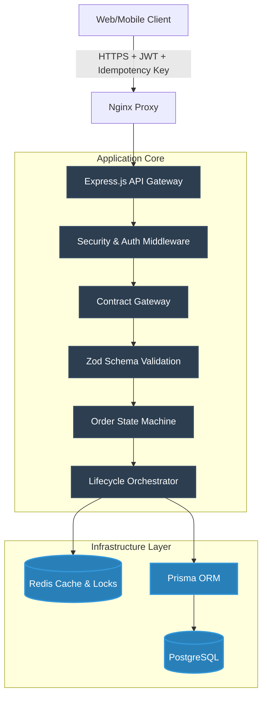

# 🚀 Al-Markazia Backend (Enterprise Grade)


نظام إدارة الطلبات والمبيعات المركزي المتقدم (Al-Markazia) مصمم لدعم العمليات التشغيلية المعقدة للشركات عبر فروع متعددة مع التركيز على **الموثوقية (Reliability)**، **التزامن (Concurrency)**، و**الحماية (Security)**.

---

## 🌟 الميزات الهندسية المتقدمة (Core Features)

### 1. آلة الحالة المتقدمة للطلبات (Order State Machine)
لا يتم تغيير حالات الطلبات بشكل عشوائي، بل تخضع لـ **Strict State Machine**:
* **Enforced Transitions**: منع الانتقالات غير المنطقية (مثال: لا يمكن للطلب الانتقال من `pending` إلى `delivered` مباشرة).
* **Role-Based Guards**: بعض الحالات يمكن للسائق فقط نقلها، والبعض الآخر لمدير الفرع.
* **Audit Trail**: كل تغيير حالة يُسجل تلقائياً مع تفاصيل الموظف، الفرع، والسبب.

### 2. معالجة التزامن العالي (Concurrency & Idempotency)
لحماية النظام من الأخطاء عند ضغط العمل أو انقطاع شبكة الإنترنت:
* **Optimistic Locking**: استخدام `version` مع كل طلب لمنع موظفين اثنين من تعديل نفس الطلب في نفس اللحظة (Race Conditions).
* **Redis-Backed Idempotency Guard**: كل عملية تعديل حيوية (Status, Payment, Cancel) تمتلك `Idempotency-Key` لضمان تنفيذ العملية مرة واحدة فقط، حتى لو قام العميل بالنقر عدة مرات بسبب بطء الشبكة.

### 3. بنية متعددة الفروع (Multi-Tenant Branch Architecture)
* عزل كامل لبيانات الفروع.
* **Zero-Trust Branch Middleware**: لا نثق بالفرع المرسل من واجهة المستخدم، بل يتم التحقق من الصلاحيات والفرع المعين للموظف من الـ Token والـ Database لضمان عدم اختراق فرع آخر.

### 4. أمان عالي وسلامة النظام (Resilience & Security)
* **Zod Contracts**: فحص صارم للمدخلات في الـ Gateway لمنع أي بيانات خبيثة من الوصول إلى قاعدة البيانات.
* **Circuit Breakers**: النظام محمي من فشل الخدمات الخارجية (إشعارات، بوابات دفع).
* **Health Monitoring**: نظام مراقبة مستمر يعلق عمليات معينة إذا كان هناك ضغط على الخادم لحماية الخدمة من التوقف.

---

## 🏗️ البنية المعمارية (Architecture Overview)



---

## 🛠️ كيف يعمل النظام من الداخل؟ (The Request Flow)

عندما يقوم مدير بتغيير حالة الطلب من `pending` إلى `ready`:

1. **Idempotency Check**: يفحص Redis ما إذا كان هذا الطلب (عبر `Idempotency-Key`) قيد المعالجة أو تمت معالجته للتو لمنع تكرار العملية.
2. **Branch Access Validation**: يتأكد النظام أن المدير ينتمي للفرع الخاص بالطلب ولن يسمح بتعديل طلبات فروع أخرى.
3. **Gateway Contract Enforcement**: يتم فحص هيكل الطلب (`version` + `status`) باستخدام `Zod.strict()`.
4. **State Machine Verification**: التحقق مما إذا كان الانتقال من `pending` إلى `ready` مسموحاً في قانون العمل.
5. **Atomic Database Transaction**: يتم التحديث مع زيادة الـ `version` لحماية النظام من التداخل.
6. **Background Tasks**: يتم إطلاق الأحداث (Events) لإرسال إشعارات للعميل وإغلاق الـ Redis Lock.

---

## 🚀 التشغيل (Deployment)

النظام يعمل عبر Docker للبيئة الإنتاجية مما يوفر سهولة في التوسع:

```bash
# بناء وتشغيل الحاويات (Database, Redis, API, Proxy)
docker-compose -f docker-compose.yml up -d --build

# مراقبة أداء الخادم
docker logs -f al-markazia-prod-app
```

## 🔒 الممارسات الأمنية (Security Practices)
- **Rate Limiting**: لحماية واجهات الـ API من هجمات الـ DDoS.
- **Fingerprinting Guard**: رصد تغيير الجهاز لتجنب سرقة الجلسات.
- **No-Eviction Redis Policy**: ضمان عدم فقدان مفاتيح الـ Idempotency.
