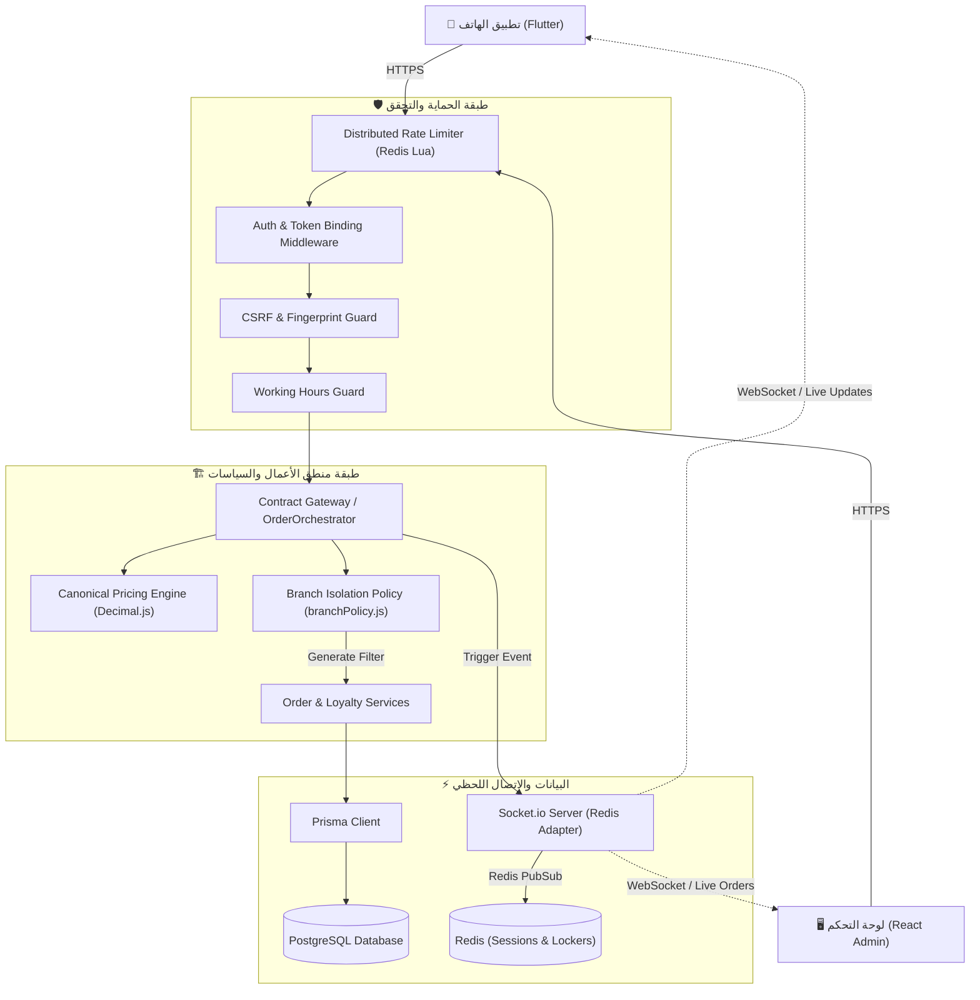
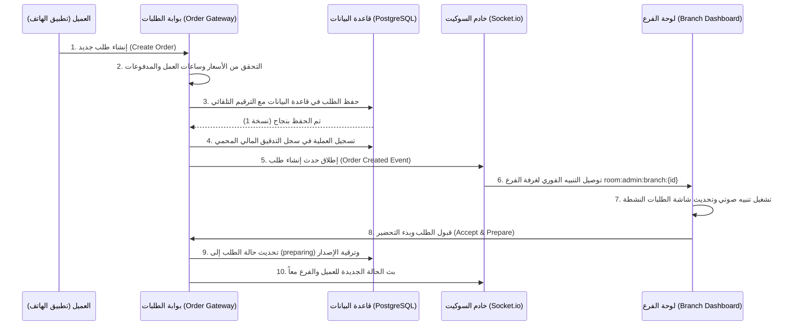

# 📒 دليل التوثيق التقني والكتالوج الشامل لمنصة "المركزية" (Al-Markazia Platform)
## نظام إدارة المطاعم متعدد الفروع والطلبات اللحظية (Multi-Branch Management & Real-Time Order System)
### الإصدار: 2.1 (Hardened & Enterprise-Grade)

---

## 📑 فهرس المحتويات
1. [مقدمة عن النظام](#1-مقدمة-عن-النظام)
2. [التقنيات المستخدمة وأسباب اختيارها](#2-التقنيات-المستخدمة-Full-Tech-Stack-Report)
3. [معمارية النظام الكاملة](#3-معمارية-النظام-الكاملة-System-Architecture)
4. [لوحة التحكم الرئيسية (Super Admin)](#4-شرح-لوحة-التحكم-الرئيسية-Admin-Dashboard)
5. [لوحات تحكم الفروع (Branch Dashboards)](#5-شرح-لوحات-تحكم-الفروع-Branch-Dashboards)
6. [نظام الأمان والتحقق وعزل البيانات](#6-نظام-الأمان-والصلاحيات-Authentication-&-Security)
7. [النظام اللحظي وإدارة الاتصالات (Sockets)](#7-النظام-اللحظي-Real-time-System)
8. [هندسة قاعدة البيانات واستراتيجية التصميم](#8-قاعدة-البيانات-Database-Schema-Design)
9. [دورة حياة الطلب التفصيلية (Order Lifecycle)](#9-دورة-حياة-الطلب-Order-Lifecycle)
10. [مميزات الحماية والنزاهة التشغيلية والمالية](#10-مميزات-النظام-الرئيسية-Key-Enterprise-Features)
11. [قابلية التوسع والنمو المستقبلي (Scalability)](#11-قابلية-التوسع-المستقبلية-Scalability-&-Future-Proofing)
12. [الخاتمة وتقييم جاهزية الإنتاج](#12-الخاتمة-وتقييم-نضج-النظام-Platform-Maturity-&-Readiness)

---

## 1. 🧠 مقدمة عن النظام (System Overview & Introduction)

### فكرة المشروع العميقة:
منصة **"المركزية"** هي نظام بيئي برمجى متكامل (Software Ecosystem) تم تصميمه لتلبية الاحتياجات التشغيلية والأمنية والمالية للمطاعم والمنشآت الغذائية متعددة الفروع إقليمياً. لا يقتصر النظام على تيسير عملية طلب الطعام للعملاء فحسب، بل يمتد ليكون نظاماً مؤسسياً متكاملاً يربط بين تجربة المستخدم النهائي عبر الهواتف الذكية، ولوحات التحكم التشغيلية للفروع، وبرج المراقبة المركزي للإدارة التنفيذية، مع ضمان النزاهة المالية والحماية المطلقة للبيانات ضد التداخل أو التلاعب.

### المشكلة التي يحلها النظام:
1. **تسريب وتضارب البيانات بين الفروع (Cross-Branch Data Leakage):** في الأنظمة التقليدية، يسهل على موظفي الفروع الاطلاع على بيانات فروع أخرى أو مبيعاتها. "المركزية" يحل هذه المشكلة من خلال طبقة عزل صارمة قائمة على الهوية (Identity-Based Branch Isolation Policy).
2. **عدم الاتساق والنزاعات المالية (Financial Drift & Concurrency Conflict):** مشاكل معالجة الطلبات بالتزامن (مثل تعديل الطلب من الفرع وفي نفس الوقت من قبل الزبون) تؤدي لضياع المبيعات أو فروقات محاسبية. يتم حل هذا عبر محرك الحسابات الموحد (Canonical Pricing Engine) وبنى الإقفال الثنائية المتفائلة والمتشائمة (Optimistic & Pessimistic Locking).
3. **تأخر التحديثات اللحظية (Real-time Latency):** في أوقات الذروة، تفشل خوادم الويب العادية في تحديث شاشات الفروع بالطلب الجديد فوراً. تم حل هذا عبر معمارية سوكيت موزعة (Distributed Sockets) مدعومة بـ Redis Adapter.
4. **أخطاء التوقيت الإقليمي (Timezone & DST Issues):** المطاعم التي تعمل عبر دول متعددة تواجه أخطاءً في حساب "ساعات السعادة" (Happy Hour) والتقارير المالية اليومية بسبب تباين المناطق الزمنية والتوقيت الصيفي. يوفر النظام آلية ذكية مدركة للمناطق الزمنية (Timezone-Aware Scheduled Services).

### تصنيف النظام (System Classification):
*   **SaaS / Multi-tenant Architecture:** مبني ليدعم تعدد المستأجرين مع عزل كامل للبيانات وعمليات الفروع.
*   **Real-Time Event-Driven System:** يعتمد على نموذج الأحداث اللحظية لتوصيل الطلبات وتحديث الحالة دون الحاجة لتحديث الصفحة يدوياً.
*   **Enterprise-Grade Security:** يتبع مبدأ "التحقق المطلق وعدم الثقة الافتراضية" (Zero Trust CBAC).

---

## 2. 💻 التقنيات المستخدمة (Full Tech Stack Report)

تم اختيار كل تقنية في هذا النظام بناءً على دراسة دقيقة للمزايا والبدائل المتاحة لتوفير أداء عالٍ وأمان ممتاز وقابلية للتوسع:

| الطبقة (Layer) | التقنية المستخدمة (Tech Stack) | سبب الاختيار والمقارنة مع البدائل |
| :--- | :--- | :--- |
| **Backend Core** | **Node.js (Express)** | تم اختياره للأداء الفائق في معالجة طلبات الإدخال والإخراج غير المتزامنة (Asynchronous I/O)، وهو مثالي للأنظمة اللحظية المعتمدة على الأحداث. البدائل مثل Go تقدم أداءً ممتازاً ولكن سرعة التطوير والمرونة في معالجة الـ JSON جعلت Node.js الخيار الأمثل مع Prisma. |
| **Database & ORM** | **PostgreSQL + Prisma ORM** | قاعدة بيانات PostgreSQL هي الرائدة في اتساق البيانات والنزاهة المالية والدعم الكامل لمعاملات ACID. تم تفضيلها على MongoDB (NoSQL) لأن النظام مالي بالدرجة الأولى ويتطلب علاقات متينة وعمليات قفل سجلات (Pessimistic Locking). استخدام Prisma يضمن سلامة الأنواع (Type Safety) وسرعة كتابة الاستعلامات الآمنة. |
| **Real-time Engine** | **Socket.io + Redis Adapter** | يوفر اتصالات ثنائية الاتجاه فائقة السرعة مع قدرة التراجع التلقائي (Fallback to Polling) في حال تعطل WebSockets. تم دمج Redis Adapter لربط خوادم سوكيت متعددة أفقياً لضمان توزيع الأحداث بنجاح عبر خوادم متعددة (Socket Clustering). |
| **Frontend Dashboard** | **React (Vite + Tailwind CSS)** | لتوفير واجهة مستخدم فائقة الاستجابة وسريعة التحميل. تم تفضيل React على Angular لسهولة إدارة الحالة وخفة الوزن، واستخدام Vite يضمن بناءً سريعاً وتجربة تطوير ممتازة، بينما Tailwind يوفر مرونة كاملة في التصميم والتحكم بالسمات (Dark/Light Mode). |
| **Mobile Application** | **Flutter (Dart)** | بناء تطبيق هاتف واحد يعمل بكفاءة عالية جداً على نظامي iOS و Android بأداء قريب من الـ Native وتصميم موحد وجميل، مما يقلل تكلفة ووقت التطوير مقارنة بالـ Swift/Kotlin. |
| **Cache & Limiting** | **Redis** | لتسريع مصادقة الجلسات (Session Validation)، وإدارة القفل المالي المؤقت، وتخزين التوكنات الملغاة (Token Blacklisting)، وتقييد معدل الطلبات الموزع (Distributed Rate Limiting) عبر Lua Scripts لضمان تنفيذ العمليات بشكل ذري وبدون Race Conditions. |

---

## 3. 🏗️ معمارية النظام الكاملة (System Architecture)

يعتمد نظام "المركزية" على معمارية الطبقات المنفصلة (Layered Architecture) لضمان فصل المسؤوليات وسهولة الصيانة والتوسع:

### 1. طبقة الواجهات (Frontend Layer):
*   **تطبيق Flutter:** يتواصل مع الـ API عبر بروتوكول HTTPS ومع الـ Sockets عبر اتصال WebSocket مباشر لتحديثات الطلبات اللحظية. يدعم التخزين المحلي الآمن وقراءة البصمة الحيوية (Biometrics).
*   **لوحة تحكم React:** لوحة موحدة مبنية على المكونات (Components) تتكيف واجهاتها وصلاحياتها ديناميكياً بحسب دور المستخدم وصلاحيات الفرع (RBAC & Branch Permissions).

### 2. طبقة الحماية والبوابات (Gateway & Middleware Layer):
*   **Advanced Rate Limiter:** لحماية خوادم الـ API من هجمات DDoS وتجاوز موازن الحمل.
*   **Authentication & Token Binding:** التحقق من صلاحية JWT مع ربط بصمة الجهاز (Device Fingerprint) لمنع اختطاف الجلسات (Session Hijacking)، والتحقق من CSRF للمتصفحات.
*   **Audit Middleware:** تسجيل حركات المستخدمين بالتفصيل مع إزالة البيانات الحساسة (PII Sanitization).
*   **Working Hours Guard:** منع إنشاء الطلبات خارج أوقات عمل الفرع المحددة.

### 3. طبقة منطق الأعمال والسياسات (Services & Policy Layer):
*   **Services (Order, Pricing, Loyalty, Branch):** طبقة تحتوي على منطق العمل الأساسي، وهي معزولة تماماً عن تفاصيل HTTP.
*   **Branch Isolation Policy (`branchPolicy.js`):** محرك أمني ذو صفر ثقة (Zero-Trust CBAC) يولد فلاتر استعلام تلقائية لحماية قاعدة البيانات من أي تسريب للبيانات بين الفروع.

### 4. طبقة الاتصال اللحظي (Real-time Layer):
*   **Socket.io Server:** يدير غرف الاتصال المؤمنة (Rooms) مثل غرف الإدارة العامة، وغرف الفروع الخاصة، وغرف المستخدمين الفردية، مع إعادة تقييم دوري للصلاحيات (60 ثانية) وإلغاء فوري للاتصالات المشبوهة.

### 5. طبقة البيانات (Database Layer):
*   **PostgreSQL:** المستودع المركزي للبيانات.
*   **Prisma Client:** وسيط الاستعلام الآمن والمنظم.

### مخطط تدفق البيانات (Architecture Flowchart):



---

## 4. 🧾 شرح لوحة التحكم الرئيسية (Admin Dashboard)

لوحة التحكم الرئيسية هي شاشة التحكم الموحدة للمسؤولين العامين (Super Admins) وتتميز بالتالي:

### أقسام اللوحة والوظائف:
1. **برج المراقبة اللحظي (Live Operations Board / LiveDashboard):** شاشة تفاعلية تعرض تدفق الطلبات عبر الفروع لحظة بلحظة، وحالة نشاط الفروع (مفتوح، مغلق، مغلق للطوارئ).
2. **إدارة الفروع (Branch Management / BranchManager):** إضافة فروع جديدة، تعديل بيانات الاتصال، إدارة ساعات العمل، وإيقاف الفروع طارئاً مع توضيح سبب الإغلاق.
3. **مستودع الأطعمة العالمي (Global Menu Management / MenuManager):** إضافة وتعديل الفئات والأطعمة والخيارات الإضافية (Modifiers) وتحديد توفرها عالمياً أو تخصيصها لفروع معينة.
4. **برج الموافقات المالية (Financial Approval Tower):** شاشة مخصصة لإدارة العمليات الحساسة التي تتطلب موافقة يدوية من الإدارة العامة، مثل طلبات استرجاع الأموال (Refunds) أو تعديل الأسعار يدويًا على الفواتير.
5. **نظام إدارة الولاء والمكافآت (Loyalty Hub & Reward Store):** تعديل إعدادات النقاط لكل دينار، فئات المستخدمين (Silver, Gold, Platinum)، وإضافة سلع لمتجر المكافآت.
6. **شاشات المراقبة وسجلات التدقيق (Security & System Audit Logs):** عرض شامل لجميع حركات النظام للموظفين (Before/After) مع عناوين الـ IP والأجهزة، لضمان المساءلة التامة.

---

## 5. 🏢 شرح لوحات تحكم الفروع (Branch Dashboards)

عندما يقوم موظف أو مدير فرع (Branch Manager) بتسجيل الدخول، تتكيف اللوحة تلقائياً لتعرض له صلاحيات فرعه فقط، مع حجب كامل لبيانات الفروع الأخرى:

### الميزات والقيود الأمنية للفرع:
*   **العزل التام للبيانات (Data Isolation):** لا يمكن لمدير الفرع رؤية طلبات، مبيعات، أو سجلات تدقيق أي فرع آخر. يتم فرض هذا العزل في طبقة قاعدة البيانات من خلال فلتر مخصص ينشئه [branchPolicy.js](file:///c:/Users/User/Desktop/p4/al_markazia_backend/src/policies/branchPolicy.js).
*   **لوحة الطلبات الحية للفرع (Branch Live Orders):** شاشة محدثة لحظياً عبر السوكيت تعرض الطلبات الحالية للفرع مقسمة حسب حالتها (Pending, Preparing, Ready, Delivered, Cancelled) مع تنبيهات صوتية ومرئية عند استلام أي طلب جديد.
*   **إدارة توفر الأصناف بالفرع (Branch Menu Availability / BranchMenu):** يملك مدير الفرع صلاحية إيقاف توفر وجبة معينة مؤقتاً في فرعه فقط (مثال: نفاد الكمية) دون التأثير على توافرها في باقي الفروع.
*   **حماية العمليات الحساسة عبر رمز الـ PIN:** عند قيام مدير الفرع بأي إجراء إداري حساس (مثل تغيير أسعار التوصيل أو تعديل ساعات العمل)، تظهر شاشة تأكيد الهوية [PinGuard.jsx](file:///c:/Users/User/Desktop/p4/admin_panel/src/components/PinGuard.jsx) تطلب رمز PIN الخاص به المكون من 4 أرقام، ويتم التحقق منه في الباكيند مع حظر الحساب مؤقتاً بعد عدة محاولات خاطئة.

---

## 6. 🔐 نظام الأمان والصلاحيات (Authentication & Security)

تتخذ منصة "المركزية" إجراءات أمنية مشددة على مستوى الباكيند والفرونت إند لمنع أي اختراق أو تلاعب:

### 1. تدفق المصادقة (Authentication Flow):
*   يتم استخدام الـ **Access Tokens (JWT)** لإثبات الهوية، ويتم إرسالها إما في ترويسة الطلب `Authorization` أو عبر ملفات تعريف الارتباط الآمنة (Secure Cookies).
*   **Token Binding:** لتفادي هجمات سرقة الجلسات (Session Hijacking)، يتم دمج وتخزين بصمة جهاز المستخدم (Device Fingerprint) مع الجلسة النشطة في خادم Redis ومطابقتها مع بصمة جهاز كل طلب قادم. يُستثنى من ذلك اتصالات الموبايل الموثقة برقم العتاد البيومتري (Biometric Hardware-Trusted).
*   **حماية CSRF:** لعمليات الويب التي تعدل الحالة (POST, PUT, PATCH, DELETE) والتي تستخدم ملفات تعريف الارتباط للمصادقة، يفرض النظام التحقق المزدوج من الـ Cookies والترويسة `x-xsrf-token` (Double Cookie Submit Validation).

### 2. دور ومكونات ملف [branchPolicy.js](file:///c:/Users/User/Desktop/p4/al_markazia_backend/src/policies/branchPolicy.js):
يعتبر هذا الملف العمود القبلي لعزل الفروع وصلاحيات الموظفين:
*   **التحقق الفوري من قاعدة البيانات:** بدلاً من الثقة التامة بالبيانات المخزنة في توكن الـ JWT والتي قد تكون قديمة (مثل موظف تم نقله أو إيقافه)، يقوم ملف `branchPolicy.js` بالتحقق من حالة الموظف ودوره الفعلي في قاعدة البيانات (DB-First Truth) قبل استرجاع أي فلتر.
*   **توليد فلاتر الاستعلام الصارمة (Hardened Prisma Filters):**
    ```javascript
    async getHardenedFilter(userId, requestedBranchId = null) {
      const truth = await this.validateAndGetTruth(userId);
      if (!truth) return { id: -1 }; // Deny-by-default (Impossible ID)

      const { role, branchId } = truth;

      // 1. الأدمن العام يستطيع الوصول لكل الفروع
      if (this.hasCapability(role, CAPABILITIES.READ_ALL)) {
        if (requestedBranchId) return { branchId: requestedBranchId };
        const activeBranches = await prisma.branch.findMany({ 
          where: { isDeleted: false }, select: { id: true } 
        });
        return { branchId: { in: activeBranches.map(b => b.id) } };
      }

      // 2. مدير الفرع مقيد بـ branchId الخاص به فقط
      if (this.hasCapability(role, CAPABILITIES.READ_BRANCH)) {
        if (!branchId) return { id: -1 };
        return { branchId: branchId };
      }

      return { id: -1 }; // صمام الأمان الأخير
    }
    ```

---

## 7. ⚡ النظام اللحظي (Real-time System)

يعتمد البث اللحظي للبيانات في "المركزية" على مكتبة **Socket.io** مع حماية أمنية مشددة وإدارة ذكية لتدفق البيانات (Backpressure):

### 1. تقسيم غرف السوكيت (Socket Rooms):
يتم توزيع المستخدمين والأجهزة المتصلة على غرف بث متخصصة لمنع إرسال البيانات لمن لا يملك صلاحية رؤيتها:
*   **`room:admin:global`**: غرف الإدارة العامة، تستقبل جميع أحداث الطلبات والتحديثات لجميع الفروع.
*   **`room:admin:branch:${branchId}`**: غرف خاصة بكل فرع، يستمع لها موظفو هذا الفرع فقط لاستلام طلباتهم وتحديثاتها.
*   **`room:user:${customerUuid}`**: غرف خاصة بالزبائن، تستخدم لتحديث حالة الطلب الخاص بالزبون لحظياً على هاتفه الذكي.

### 2. آليات حماية وتأمين الاتصال اللحظي:
*   **حماية CSRF للويب:** للمتصفحات، يتم تطبيق نموذج Double Cookie Submit للاتصال الأولي (Handshake).
*   **التحقق المستمر من الصلاحيات (Authorization Lease 60s):** لضمان عدم استمرار اتصال موظف تم إيقافه أو تعديل صلاحياته، يقوم خادم السوكيت بإعادة التحقق من حالة المستخدم ودوره وصلاحياته في قاعدة البيانات كل 60 ثانية بشكل دوري. إذا تم اكتشاف تغيير، يتم طرد المستخدم فوراً وإغلاق الاتصال.
*   **التحكم بمعدل الاتصال (Concurrent Connection Limit):** يتم حظر أي مستخدم يحاول فتح أكثر من 5 اتصالات متزامنة باسمه لمنع هجمات الاستنزاف (Resource Exhaustion).
*   **إدارة المستهلك البطيء والضغط العكسي (Slow Consumer & Backpressure):** إذا امتلأ مخزن السوكيت للعميل (Buffer > 512KB) بسبب بطء الإنترنت لديه، يقوم السيرفر تلقائياً بتقليل حجم البيانات المرسلة وإرسال إشارات تحديث قصيرة (Invalidation Events) بدلاً من كامل كائنات البيانات لتجنب انهيار الخادم.

---

## 8. 💾 قاعدة البيانات (Database Schema Design)

تستخدم المنصة قاعدة بيانات علاقاتية محكمة التصميم (PostgreSQL) لضمان اتساق وسلامة البيانات.

### أهم الجداول والعلاقات:
1. **User (الموظفين والأدمن):**
    *   يدعم كلاً من المعرف الرقمي `id` للربط السريع داخلياً، والمعرف العالمي `uuid` للاستخدام الخارجي والأمني.
    *   يحتوي على `branchId` لربط الموظف بفرعه، و `tokenVersion` / `authVersion` لإلغاء الجلسات فوراً عند الضرورة.
2. **Customer (الزبائن):**
    *   جدول منفصل تماماً عن الموظفين لتعزيز الخصوصية. يحتوي على نقاط الولاء `points` ورصيد المحفظة الإلكترونية `walletBalance` ودرجة تصنيف العميل (Silver, Gold, Platinum).
3. **Branch (الفروع):**
    *   الكيان الأساسي في عزل البيانات. يرتبط بالفروع والمبيعات والمخزون والموظفين.
4. **Order (الطلبات):**
    *   يرتبط بـ `branchId` و `customerId`.
    *   يحتوي على حقول التتبع الزمني وحالة الطلب والمدفوعات.
    *   يدعم خاصية الحماية من تضارب الحالة عبر `version` و `eventSequence` للـ Optimistic Locking.
5. **OrderItem (تفاصيل الطلب):**
    *   ترتبط بـ `orderId` و `itemId`.
    *   تدعم تسجيل السعر الفعلي عند الطلب `unitPrice` لضمان عدم تأثر الفواتير القديمة بأي تغيير لاحق لأسعار الوجبات.

### آلية الربط وعزل الفروع (Database Multi-Tenancy Design):
يحتوي كل جدول مرتبط بعمليات المطعم (مثل الطلبات، الأصناف المتوفرة بالفرع، القيود المالية، سجلات التدقيق) على حقل `branchId` إجباري. عند تنفيذ أي استعلام، يتم حقن شرط `where: { branchId: ... }` تلقائياً عبر وسيط السياسات لضمان عدم تداخل البيانات.

---

## 9. 🔄 دورة حياة الطلب (Order Lifecycle)

يمر الطلب بدورة حياة صارمة وموثقة لضمان دقة العمليات:



1.  **إنشاء الطلب:** ينشئ العميل الطلب عبر تطبيق الهاتف (أو يتم إدخاله يدوياً من الأدمن).
2.  **التدقيق والاحتساب المالي:** يتحقق الباكيند من أسعار العناصر، أوقات العمل للفرع، وصلاحية الخصومات أو ساعات السعادة (Happy Hour) عبر `PricingService`.
3.  **الحفظ والتأمين:** يتم تخزين الطلب في PostgreSQL ككائن غير قابل للتغيير (Immutable Aggregate State) مع إسناد رقم ترتيب زمني أحادي الاتجاه `eventSequence` وقيمة إصدار أولية `version = 1`.
4.  **الإرسال عبر السوكيت:** يرسل الباكيند إشعاراً لغرفة البث المخصصة للفرع المعني `room:admin:branch:${branchId}`.
5.  **التحديث والمعالجة بالفرع:** تظهر تفاصيل الطلب على لوحة الفرع بشكل مباشر مع التنبيه الصوتي. عند قيام الموظف بتحديث الحالة (تجهيز، شحن، إلخ)، يتم تدوين التغيير في قاعدة البيانات والتحقق من الإصدار لمنع تعارض الحالات (OCC)، وبث التحديث النهائي لهاتف العميل لتتبع الطلب.

---

## 10. 🧩 مميزات النظام الرئيسية (Key Enterprise Features)

1.  **عزل الفروع الذكي (Branch Isolation & Zero Trust):** منع تسريب المعلومات والوصول غير المصرح به تماماً على مستوى كود البنية التحتية وقاعدة البيانات.
2.  **الحماية المالية والنزاهة المحاسبية (Financial Integrity):** استخدام قفل السجلات المتشائم `SELECT FOR UPDATE` لمنع حدوث Race Conditions أثناء تعديل الحسابات أو استرجاع الأموال، مع معالجة الأرقام بالدقة المصرفية عبر `Decimal.js` لضمان دقة الولاء.
3.  **تتبع الحركات وسجل التدقيق المالي والتشغيلي (Sanitized System Audit Logs):** جميع عمليات الإدخال والتعديل وحركات الفروع يتم تسجيلها وتعميتها من البيانات الحساسة (PII Sanitization) لضمان الخصوصية والمساءلة.
4.  **نظام ساعات السعادة الذكي إقليمياً (Timezone-Aware Happy Hours):** نظام تسعير ترويجي يتكيف تلقائياً مع التوقيت المحلي لكل فرع ومناطقه الزمنية الجغرافية بدقة تامة.
5.  **مزامنة نزاعات الحالة غير المتصلة بالإنترنت (Offline Concurrency Resolution):** معالجة وحل تعارض البيانات في حال استلاف تحديثات من جهاز انقطع اتصاله بالإنترنت ثم عاد للشبكة لاحقاً، اعتماداً على إصدارات الكيانات وأوقات التعديل.

---

## 11. 🚀 قابلية التوسع والنمو المستقبلي (Scalability & Future-Proofing)

تم تصميم النظام بهندسة برمجية تسمح له بالنمو لدعم آلاف المستخدمين والفروع دون تراجع في الأداء:

1.  **التحول الكامل إلى نموذج SaaS (Multi-Tenancy):**
    *   تم تجهيز الجداول الرئيسية بحقل `tenantId` (المستأجر)، مما يسمح باستضافة مطاعم وشركات مختلفة تماماً على نفس البنية التحتية مع عزل كامل لقواعد البيانات أو الجداول لكل مستأجر.
2.  **توسيع خدمات الاتصال اللحظي (Socket Clustering):**
    *   بفضل استخدام Redis Adapter للـ Sockets، يمكن تشغيل خوادم السوكيت في بيئة موزعة (مثل Kubernetes Pods) خلف موازن حمل (Load Balancer)، حيث ينسق Redis نقل الأحداث بين السيرفرات المختلفة بكفاءة متناهية.
3.  **توسيع قاعدة البيانات (Database Read Replicas & Sharding):**
    *   يمكن توجيه استعلامات القراءة (مثل تصفح الأصناف وقراءة التقارير) إلى نسخ قاعدة بيانات فرعية مخصصة للقراءة فقط (Read Replicas)، بينما تذهب عمليات الكتابة (إنشاء الطلبات وحركات الأموال) إلى قاعدة البيانات الأساسية (Primary DB).

---

## 12. 🧠 الخاتمة وتقييم نضج النظام (Platform Maturity & Readiness)

بناءً على التقييم الهندسي الشامل والتدقيق البرمجي المستمر، تم تصنيف نظام **"المركزية"** كالتالي:

*   **مستوى النضج التقني (Technical Maturity Level):** **Enterprise Grade (ممتاز)**. يحتوي النظام على معالجة متطورة للأخطاء وحماية ضد التضارب ونظام توثيق وسجلات تدقيق ومصادقة مزدوجة وقيود صارمة على الفروع.
*   **جاهزية الإنتاج (Production Readiness):** **جاهز تماماً للإطلاق الفوري للإنتاج (Production Ready)**. تم حل جميع الثغرات الأمنية ومعالجة Race Conditions وإيقاف تسريب البيانات بين الفروع، مع توفير سكريبتات فحص وتأكيد آلية تضمن استقرار النظام بعد أي عملية نشر جديدة.

---
> [!IMPORTANT]
> تم إعداد هذا التقرير التقني لصالح مشروع "المركزية" لإدارة المطاعم متعدد الفروع ليكون مرجعاً تقنياً معتمداً للفريق الهندسي والإداري.
