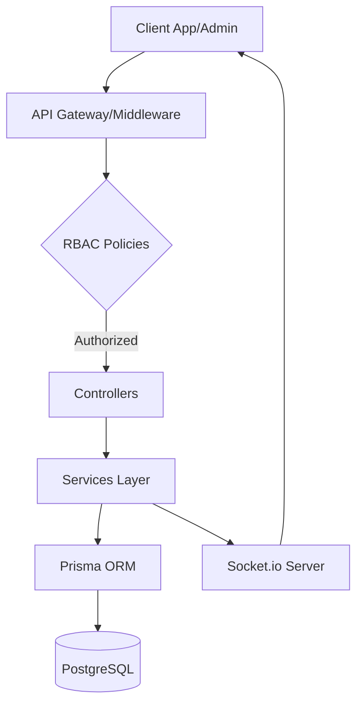

# 📒 كتالوج مشروع المركزية (Al-Markazia Project)
## دليل الاستخدام والتوثيق التقني الشامل (الإصدار 1.0)

مرحباً بك في الدليل الشامل لمشروع **المركزية**. تم تصميم هذا الكتالوج ليكون المرجع الأول لكل تفصيلة في النظام، بدءاً من تجربة المستخدم النهائي وصولاً إلى أدق تفاصيل البنية التحتية وقواعد البيانات.

---

## 📑 فهرس المحتويات
1. [نظرة عامة على المشروع](#نظرة-عامة-على-المشروع)
2. [تطبيق الهاتف (Al-Markazia App)](#تطبيق-الهاتف)
3. [لوحات التحكم والعمليات (Dashboards)](#لوحات-التحكم)
4. [البنية التحتية والباكيند (Backend Services)](#الباكيند)
5. [هندسة قواعد البيانات (Database Schema)](#قواعد-البيانات)
6. [نظام الحماية والنزاهة المالية (Security & Integrity)](#نظام-الحماية)
7. [طريقة التشغيل والصيانة](#التشغيل-والصيانة)

---

## 🚀 نظرة عامة على المشروع
مشروع "المركزية" هو نظام متكامل لإدارة المطاعم والطلبات متعدد الفروع، يركز على الكفاءة التشغيلية، الحماية المالية القصوى، وتجربة مستخدم سلسة.

### 🛠 التقنيات المستخدمة (Tech Stack)
*   **تطبيق الهاتف:** Flutter (Dart) - أداء عالٍ وتجربة Native.
*   **لوحة التحكم:** React (JavaScript) - واجهات ديناميكية وسريعة.
*   **الباكيند:** Node.js (Express) - معمارية Microservices/Service-Layer.
*   **قاعدة البيانات:** PostgreSQL مع Prisma ORM.
*   **التواصل اللحظي:** Socket.io للتنبيهات وتتبع الطلبات.
*   **الحماية:** AES-256-CBC للتشفير، و Pessimistic Locking للعمليات المالية.

---

## 📱 تطبيق الهاتف (Al-Markazia App) <a name="تطبيق-الهاتف"></a>
التطبيق هو الواجهة الرئيسية للعملاء، صُمم بأسلوب "Premium" مع التركيز على السرعة والجمالية.

### 🌟 الميزات الرئيسية:
1.  **نظام الدخول الذكي:** يدعم تسجيل الدخول التقليدي وبصمة الإصبع (Biometric Auth).
2.  **تتبع الطلبات اللحظي (Live Tracking):** واجهة متقدمة تعرض حالة الطلب لحظة بلحظة عبر الـ Sockets.
3.  **نظام الولاء (Loyalty Hub):** مركز متكامل للعميل لمتابعة نقاطه، ترقية فئته (Silver, Gold, Platinum)، واستبدال النقاط بمكافآت.
4.  **إدارة العربة (Smart Cart):** دعم كامل للإضافات (Options)، الملاحظات، وحساب رسوم التوصيل بناءً على المنطقة.
5.  **التنبيهات الذكية:** نظام تنبيهات Push Notifications يخبر العميل بكل جديد.

> [!TIP]
> يستخدم التطبيق `Shimmer Effect` لتحسين تجربة التحميل، ونظام `App Events` لتتبع سلوك المستخدم وتحسين الخدمة.

---

## 🖥 لوحات التحكم والعمليات (Dashboards) <a name="لوحات-التحكم"></a>
تم تقسيم صلاحيات الإدارة لضمان أمن البيانات وفصل المسؤوليات.

### 1. لوحة المدير العام (Super Admin)
*   إدارة الفروع (إضافة، تعديل، إغلاق طوارئ).
*   التحكم في الإعدادات العالمية (رسوم التوصيل، سياسات الإلغاء).
*   برج المراقبة المالي (Financial Control Tower) للموافقة على العمليات الحساسة.

### 2. لوحة مدير الفرع (Branch Manager)
*   استلام ومعالجة الطلبات الخاصة بالفرع فقط.
*   إدارة توفر العناصر (In-stock/Out-of-stock) في الفرع.
*   تغيير حالة الفرع والطلبات.

### 3. مركز العمليات (Operations Center)
*   شاشة مراقبة لحظية لكل الطلبات النشطة.
*   إحصائيات ذكية (Metrics) توضح أداء الفروع.

---

## ⚙️ البنية التحتية والباكيند (Backend Services) <a name="الباكيند"></a>
الباكيند هو "العقل المدبر" للنظام، يعتمد على معمارية منظمة جداً لضمان القابلية للتوسع (Scalability).

### 🏗 الهيكل التنظيمي (Core Architecture):
*   **Controllers:** معالجة طلبات الـ API والتحقق من المدخلات.
*   **Services:** تحتوي على منطق الأعمال (Business Logic) - مثل `OrderService`, `LoyaltyService`.
*   **Middleware:** طبقات الحماية، التحقق من التوكن (JWT)، والتحقق من الصلاحيات (RBAC).
*   **Policies:** قوانين صارمة تحدد من يمكنه القيام بكل فعل بناءً على دوره.



---

## 🗄 هندسة قواعد البيانات (Database Schema) <a name="قواعد-البيانات"></a>
تتميز قاعدة البيانات بتصميم "علاقاتي" (Relational) محكم يضمن سلامة البيانات (Data Integrity).

### 🔑 الكيانات الرئيسية:
*   **User / Customer:** فصل تام بين الموظفين والعملاء مع تشفير البيانات الحساسة (PII).
*   **Branch:** الكيان المركزي الذي يربط الطلبات والموظفين والمخزون.
*   **Order / OrderItem:** سجلات مفصلة لكل طلب، مع نظام "نسخ الأسعار" لضمان عدم تأثر الطلبات القديمة بتغير الأسعار الحالي.
*   **FinancialLedger:** "دفتر الأستاذ" المالي، يسجل كل قرش يدخل أو يخرج من النظام.

---

## 🛡 نظام الحماية والنزاهة المالية (Security & Integrity) <a name="نظام-الحماية"></a>
هذا هو الجزء الأكثر فخراً في مشروع المركزية:

1.  **تشفير البيانات (Field-level Encryption):** أرقام الهواتف والإيميلات تُشفر قبل دخولها لقاعدة البيانات (AES-256) مع استخدام `Blind Indexing` للبحث السريع دون فك التشفير.
2.  **القفل المالي (Pessimistic Locking):** عند معالجة طلب مالي، يتم قفل السجل في قاعدة البيانات (`SELECT FOR UPDATE`) لمنع أي تضارب أو عمليات مزدوجة (Race Conditions).
3.  **برج الموافقات المالية (Financial Approval Tower):** العمليات مثل (استرجاع الأموال، تعديل الأسعار اليدوي) لا تتم فوراً، بل تُرسل لبرج المراقبة لطلب موافقة المدير العام.
4.  **سجل التدقيق (Audit Logs):** كل حركة يقوم بها الموظف (تغيير حالة طلب، تعديل إعداد) تُسجل مع الـ IP ونوع الجهاز والتغيير الذي حدث (Before/After).

---

## 🔧 طريقة التشغيل والصيانة <a name="التشغيل-والصيانة"></a>

### تشغيل الباكيند:
```bash
cd al_markazia_backend
npm install
npx prisma generate
npm run dev
```

### تشغيل التطبيق:
```bash
cd al_markazia_app
flutter pub get
flutter run
```

### 🛠 أدوات التحقق (Verification Scripts):
يحتوي المشروع على سكريبتات متقدمة للتحقق من سلامة النظام بعد أي تعديل:
*   `phase4_verification.js`: للتحقق من العمليات المالية والربط بين الفروع.
*   `accounting.test.js`: لاختبار دقة حسابات دفتر الأستاذ المالي.

---

> [!IMPORTANT]
> هذا المشروع ليس مجرد تطبيق طلبات، بل هو منصة مؤسسية (Enterprise-Grade) تتبع أفضل المعايير العالمية في تطوير البرمجيات.

**تم إعداد هذا الكتالوج بواسطة Antigravity AI لصالح مشروع المركزية.**
