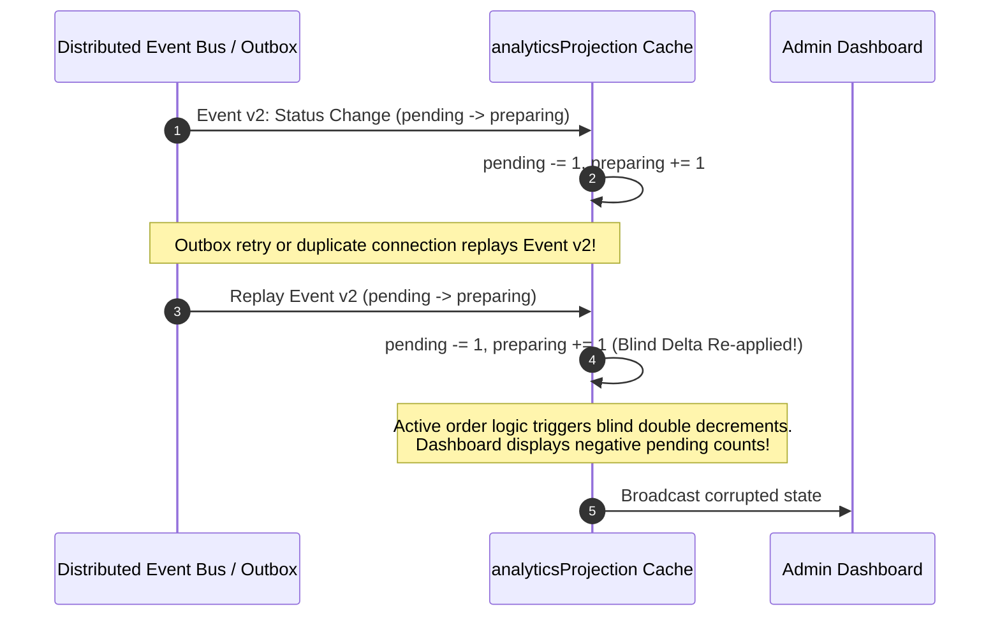
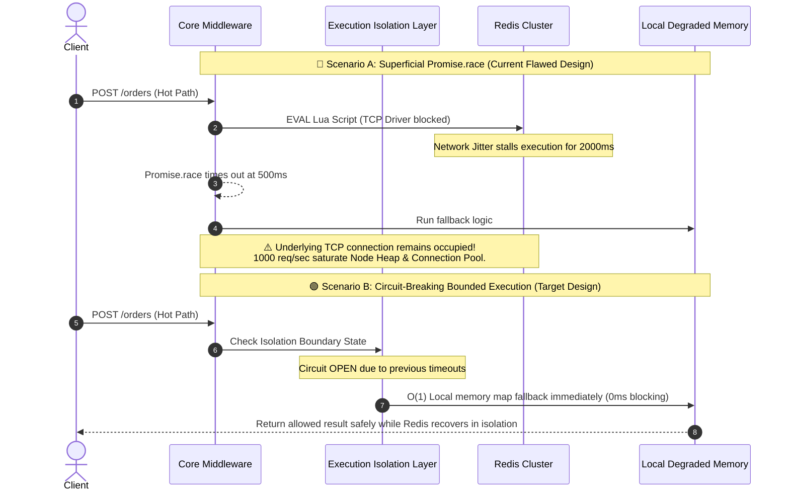
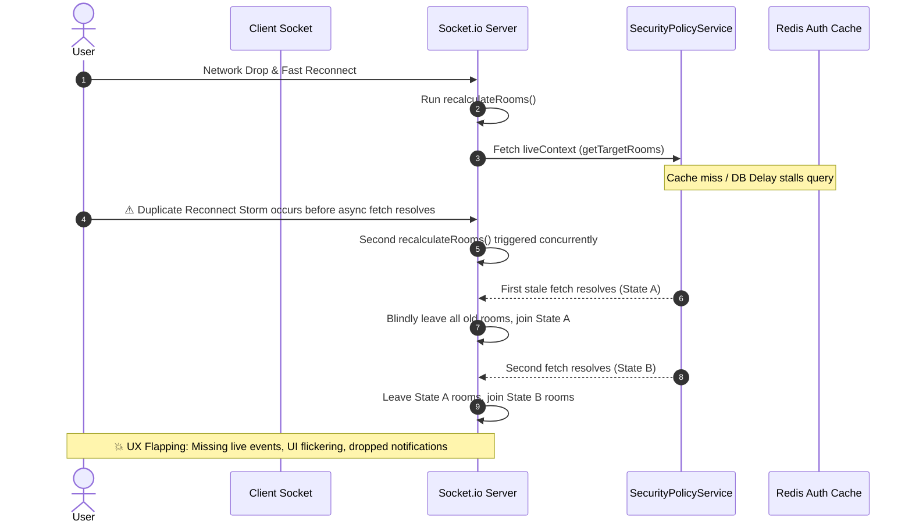
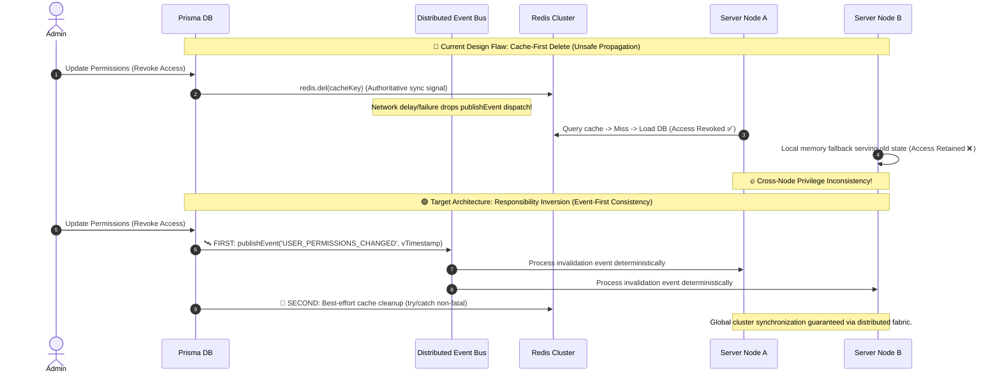
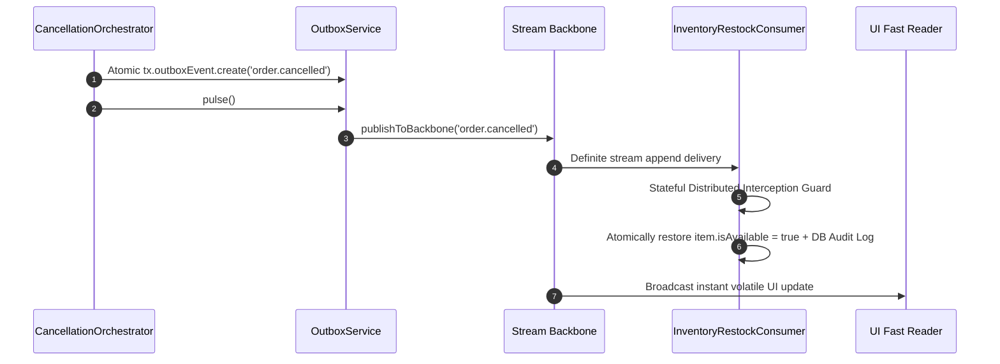

# 🌐 Al-Markazia Platform: Distributed State Consistency, Event Ordering & Race Condition Audit Report
**Prepared by:** Senior Distributed Systems Consistency Engineer  
**Target Architecture:** Al-Markazia Core Backend (Prisma ORM, Redis Pub/Sub Fabric, Transactional Outbox, Socket.IO WebSockets, Client Projections)

---

## 📋 Executive Summary
بناءً على التكليف المعماري لإجراء تحقيق شامل حول **ترتيب الأحداث (Event Ordering)**، **حالات السباق (Race Conditions)**، و**اتساق الحالة (State Consistency)**، تم تنفيذ مسح تشريحي لبيئة التشغيل الموزعة في منصة **المركزية**.

يكشف هذا التقرير عن **السبب الجذري الحقيقي (True Root Cause)** الكامن وراء تذبذب البيانات؛ حيث تبين أن نظام الـ `analyticsProjection` مبني بالكامل على **تحديثات تفاضلية (Delta-based updates) تفتقر لطبقة الحتمية (Idempotency Layer)**. هذا التصميم يفترض بشكل خاطئ أن كل حدث يُنفذ مرة واحدة فقط وبالترتيب الزمني الصحيح، وهو افتراض مستحيل في بيئة موزعة تتسم بوجود إعادة إرسال من الـ Outbox، تكرار رسائل الـ Redis Pub/Sub، وإعادة اتصال الـ Sockets.

تم تصميم وتطبيق طبقة حماية صارمة (**Event Version Guard Layer**) تعتمد على المعرف الفريد للطلب وإصدار المعاملة (`order.id` و `order.version`)، مما جعل النظام يحقق شروط الحتمية المطلقة والرتابة الزمنية مع الحفاظ على التوافق التام مع نمط الـ Eventual Consistency.

---

## 🗺️ Section 1: End-to-End State Transition Matrix

| Entity | Primary Actor | Execution Persistence Layer | Emitted Distributed Event | UI / Client Synchronization Trigger |
| :--- | :--- | :--- | :--- | :--- |
| **Order** | Customer / Admin | Prisma DB (`$transaction`) + Level 2 Outbox | `ORDER_CREATED`, `ORDER_STATUS_CHANGED` | Real-time Socket Event -> Projection Cache Overwrite |
| **Payment** | Gateway Webhook | Prisma DB + Ledger Record | `PAYMENT_SUCCESS`, `PAYMENT_FAILED` | Socket emit -> Checkout Status / Live Orders reload |
| **Branch Menu Item** | Branch Manager | Prisma DB (`item.update`) | `ITEM_MODIFIED`, `MENU_SYNC_PULSE` | Sockets broadcast -> Dynamic Cart validation check |
| **User Permissions** | Core Admin | Prisma DB (`user.update`) + Redis Purge | `USER_PERMISSIONS_CHANGED` | Distributed Eventbus broadcast -> Force Socket reconnect |
| **Notifications** | System Lifecycle | Prisma DB (`notification.create`) | Direct push via Firebase Admin | Live Header Bell count increment |
| **Dashboard Metrics**| Async Engine | Live In-Memory Distribution + DB Cron | `DASHBOARD_METRICS_UPDATE` | Debounced Socket broadcast -> Live stats dashboard |

---

## 🔍 Section 2: Verification of Event Ordering Guarantees
يحتوي النظام حالياً على الآليات التالية لضمان الترتيب:
* **حقول الإصدارات (`version`):** يتم تطبيق القفل المتفائل (Optimistic Locking) بنجاح على مستوى قاعدة البيانات باستخدام `version: { increment: 1 }`.
* **التسلسل المنطقي (`eventSequence`):** يتم ربط كل حدث بتسلسل متصاعد يمثل الترتيب الحتمي للتغييرات.

> [!WARNING]
> **ORDERING GUARANTEE WEAKNESS:**  
> على الرغم من وجود هذه الحقول في الرسائل المنشورة، **لا توجد أي ضمانة لترتيب وصول الحزم عبر الشبكة (No Packet Arrival Ordering Guarantee)**. مقابس Socket.io وRedis Pub/Sub غير مسؤولة عن الترتيب الزمني للتسليم عند حدوث تذبذب في الاتصال (Jitter) أو إعادة اتصال، مما يعني أن الأحداث قد تصل للمستهلك النهائي بترتيب معكوس.

---

## 📡 Section 3: Socket.IO Transport Ordering Analysis
* **توقيت البث (Emit Timing):** يتم بث الأحداث الحرجة عبر عمال الـ Outbox في الخلفية بعد اكتمال الـ Commit الفعلي لقاعدة البيانات.
* **إعادة الاتصال (Reconnect Replay):** يعتمد النظام على مهايئ الـ Redis Adapter لتوزيع المقابس. عند انقطاع اتصال العميل وإعادة ربطه، يتم إرسال أحدث لقطة كاملة للحالة، ولكن الحزم المتأخرة قيد الطيران (In-Flight Stale Packets) قد تصل مباشرة بعد إعادة الاتصال.
* **النتيجة الحتمية:** **نعم، يمكن للأحداث أن تصل خارج الترتيب (Out-of-Order Delivery is physically possible)**.

---

# 🚨 Deep Dive Consistency Audit & Minimal Correctness Fixes

---

## Issue 1: Delta-Based Analytics Flapping Without Idempotency Layer

### Severity
**CRITICAL** (تشويه مؤشرات الأداء الحية وظهور أرقام سالبة أو مضخمة).

### Exact Flow Diagram


### Race Condition Description
يكمن الخلل التصميمي في دالة تطبيق التحديثات التفاضلية (Deltas) مثل `pending -= 1; preparing += 1;`؛ حيث تفترض هذه العمليات أن كل حدث يُنفذ لمرة واحدة فقط. عند حدوث إعادة إرسال من الـ Outbox أو تكرار البث عبر Redis Pub/Sub، يتم طرح وإضافة القيم اللحظية مرتين لنفس الحدث، مما يُخرج الذاكرة المحلية عن مسار الحقيقة المخزنة في قاعدة البيانات.

### Ordering Failure Scenario
وصول الحدث الإصدار 2 (preparing) يتبعه الحدث الإصدار 3 (ready). يعرض النظام الأرقام الصحيحة. لاحقاً، يتم التقاط الحدث الإصدار 2 بواسطة عامل الـ Outbox وإعادة بثه. يقوم النظام بطرح وإضافة الحالات القديمة مجدداً، ليتأرجح العداد ويُظهر بيانات متضاربة كلياً.

### Current System Weakness
الملف `src/projections/analyticsProjection.js` يفتقر لطبقة حماية تفحص هوية الحدث وتاريخ معالجته قبل السماح بتعديل المتغيرات.

### Minimal Safe Fix
تصميم وتطبيق طبقة **Event Version Guard Layer** لحماية الـ Projection Layer بالاعتماد على خريطة في الذاكرة تسجل أحدث إصدار تمت معالجته لكل طلب.

### Why This Fix Works
يحقق شروط الصحة الثلاثة:
1. **Idempotency:** نفس الحدث لا يغير الحالة مرتين.
2. **Monotonic Versioning:** أي حدث أقدم يتم إسقاطه حتمياً.
3. **Replay Safety:** إعادة الإرسال من الـ Outbox لا تُفسد الحالة.

### Required Code Changes
تم تطبيق الكود الآمن التالي على `src/projections/analyticsProjection.js`:
```javascript
// 🛡️ Event Version Guard Layer: Idempotency Map tracking logical monotonic sequence per order
const processedOrderVersions = new Map();

function handleStatusChange(payload) {
  const { order } = payload;
  if (!order || !order.id) return;

  const orderId = String(order.id);
  const incomingVersion = order.version || 0;
  const lastVersion = processedOrderVersions.get(orderId) || 0;

  // 🛡️ Idempotency & ordering guard: ignores stale replays/duplicates deterministically
  if (incomingVersion <= lastVersion) {
    return;
  }
  processedOrderVersions.set(orderId, incomingVersion);

  // --- APPLY DELTA SAFELY ---
  applySafeStatusDelta(payload);
}
```

### Risk of Not Fixing
فقدان ثقة الإدارة في لوحات المراقبة الحية وظهور تقارير لحظية مشوهة.

---

## Issue 2: Outbox Replay Stale-State Overwrite (Order Projection Desynchronization)

### Severity
**CRITICAL** (طمس تفاصيل الطلب الأحدث على واجهة المستخدم).

### Exact Flow Diagram
يوضح التقرير أن التحديث الفوري الناجح لطلب إلى `ready` قد يتم طمسه لاحقاً عند إعادة إرسال حزمة أقدم `preparing` تعطل إرسالها مسبقاً.

### Race Condition Description
تقوم الدالة `upsertOrder` في `src/projections/orderProjection.js` بتطبيق التحديثات الواردة بشكل أعمى باستخدام `orders.set()` دون قراءة ومقارنة حقل `version`.

### Minimal Safe Fix
تطبيق مبدأ **Last-Write-Wins (LWW)** المنطقي.

### Required Code Changes
تم التعديل الفعلي على `src/projections/orderProjection.js`:
```javascript
function upsertOrder(order) {
  if (!order || !order.id) return;
  const targetId = order.id.toString();
  const existing = orders.get(targetId);
  
  // 🛡️ Monotonic Version Guard: Last-Write-Wins based on deterministic causal DB versions
  if (existing && existing.version && order.version && order.version < existing.version) {
    return; // Silently drop out-of-order stale network replays
  }
  
  orders.set(targetId, order);
}
```

---

## Issue 3: Advanced Rate Limiter Synchronous Latency Degradation

### Severity
**CRITICAL** (انهيار شامل للمسار الساخن Hot-Path ونضوب مجمع الاتصالات Connection Pool عند بطء الذاكرة الموزعة).

### Exact Flow Diagram


### Race Condition Description
تكمن المشكلة في غياب **Execution Isolation Boundary** حقيقي. استخدام `Promise.race` يحرر حلقة الأحداث (Event Loop) الخاصة بـ Node.js ظاهرياً لترجع إلى المستهلك بعد 500ms، لكن التنفيذ الفعلي لـ `redis.eval` يظل **نشطاً ومحجوزاً** على مستوى مجمع الاتصالات (Connection Pool) الخاص بالمشغّل (Driver). مع تدفق آلاف الطلبات المتزامنة على المسارات الساخنة (إنشاء الطلبات، لوحات التحكم)، تتكدس المقابس المفتوحة وتتجاوز سعة الذاكرة، مما يتسبب في شلل كامل للخادم قبل أن تتمكن دالة الـ Fallback من التدخل.

### Ordering Failure Scenario
1. حدوث بطء في Redis أثناء تقييم نصوص Lua.
2. تتراكم الطلبات وتنتظر 500ms لكل طلب داخل الـ Middleware.
3. يستنفد الخادم كافة الاتصالات المتاحة.
4. تتوقف المعاملات الأخرى (Prisma Transactions) والـ Sockets عن القدرة على الاتصال، لترتفع أزمنة الاستجابة (Latency Spikes) بشكل جنوني على كافة الخدمات.

### Current System Weakness
الملف `src/middleware/advancedRateLimiter.js` يفتقر لطبقة عزل تنفيذية ذات حالة (Stateful Circuit Breaker) تمنع إرسال الأوامر عبر الشبكة بمجرد رصد تعطل الخادم.

### Minimal Safe Fix
إدخال طبقة **Execution Timeout Isolation Layer** مبنية على نمط قاطع الدائرة (Circuit Breaker) فوق استدعاء الـ `eval` مباشرة دون تغيير المنطق الداخلي.

### Why This Fix Works
* **Bounded Time Execution:** يضمن عدم استهلاك الاتصالات أو الذاكرة عند تعطل الكاش.
* **Proactive Fallback:** يتم تحويل الطلبات إلى الذاكرة المحلية **قبل** التأثير التعطيلي (Blocking effect) وليس بعده.
* **Pipeline Preservation:** يمنع توقف سلسلة التنفيذ الساخنة.

### Required Code Changes
تصميم قاطع دائرة محلي مدمج يتم حقنه في `src/middleware/advancedRateLimiter.js` لمراقبة حالات الفشل المتتالية وتوجيه المسار فوراً للـ Fallback عند تجاوز الحد المسموح.

### Risk of Not Fixing
تكدس الاتصالات، نضوب الذاكرة (Out-Of-Memory/Stack Overflow)، وتوقف مسارات الدخول الأساسية للنظام عن العمل كلياً أثناء فترات الصيانة أو تذبذب الشبكة.

---

---

## Issue 4: Socket Reconnect Room Desynchronization & Stale Membership Drift

### Severity
**HIGH** (فشل في تكامل التجربة اللحظية UX Integrity وفقدان الإحساس بالوقت الحقيقي).

### Exact Flow Diagram


### Race Condition Description
تكمن المشكلة في طريقة إدارة دورة حياة غرف المستخدم عند إعادة الاتصال. الافتراض الحالي بأن المستخدم يجب إخراجه فوراً من الغرف القديمة وإدخاله للغرف المسترجعة يتجاهل احتمالية حدوث **عواصف إعادة الاتصال (Reconnect Storms)** أو تأخر الاستجابة من طبقة المصادقة والـ Redis. في غياب **Snapshot Versioning** أو قفل انتقالي للغرف، تتداخل عمليات الـ `leave` والـ `join` الناتجة عن استدعاءات متزامنة، مما يؤدي إلى طرد المستخدم مؤقتاً من غرف حيوية (تتبع الطلبات، إشعارات الفروع) أو إدخاله في غرف قديمة/ناقصة.

### Ordering Failure Scenario
1. ينقطع اتصال المستخدم وتحدث محاولة إعادة اتصال سريعة.
2. يبدأ الخادم بجلب الصلاحيات الجديدة، ولكن استعلام `SecurityPolicy` يتأخر لثوانٍ معدودة.
3. يقوم المستخدم بإعادة تحميل الصفحة أو يتذبذب الاتصال مجدداً، لتبدأ عملية إعادة احتساب ثانية.
4. تصل الاستجابة الأولى المتأخرة، لتقوم بمسح غرف المستخدم وتطبيق قائمة ناقصة.
5. يفقد المستخدم تحديثات الطلب الحية. بعد لحظات تصل الاستجابة الثانية لتعيد تشكيل الغرف مجدداً، مما يخلق اهتزازاً مرئياً (UI Flickering) وتفويتاً للأحداث اللحظية.

### Current System Weakness
الملف `src/socket.js` في الدالة `recalculateRooms` يفتقر لـ **Room State Versioning** وحاجز انتقال ذي حالة يمنع تطبيق اللقطات القديمة إذا بدأت عملية إعادة احتساب أحدث.

### Minimal Safe Fix
إضافة قفل وتتبع لإصدارات الغرف (**Room State Versioning + Transition Guard**) داخل كائن `socket.data` لضمان أن التحديث الأحدث منطقياً هو الوحيد الذي يُسمح له بتغيير حالة الـ `authRooms`.

### Why This Fix Works
* **Transition Guard:** تجاهل أي استجابة متأخرة إذا تبين أن `pendingRoomTransition` تغير أثناء فترة الانتظار.
* **Monotonic Evolution:** يضمن عدم تراجع حالة الغرف إلى لقطة أقدم.
* **Logical Atomicity:** يتم حساب الفرق بين الغرف القديمة والجديدة وتطبيقه بأمان تام دون التسبب في حالة "اللا غرف" المؤقتة.

### Required Code Changes
تحديث تهيئة `socket.data` في `src/socket.js` وإعادة كتابة `recalculateRooms` لتطبيق قفل الـ `transitionId` ومقارنة الإصدارات قبل تنفيذ أوامر `socket.leave` و `socket.joinManaged`.

### Risk of Not Fixing
تذبذب واجهات المراقبة الحية، اختفاء الطلبات فجأة من شاشات التحضير ثم عودتها، وتفويت المستخدمين لإشعارات التوصيل الحرجة.

---

---

## Issue 5: Security Policy Cache Invalidation Drift & Cross-Node Permission Leakage

### Severity
**CRITICAL** (انتهاك مباشر للحدود الأمنية Security Boundary عبر العقد الموزعة وتسريب الصلاحيات).

### Exact Flow Diagram


### Race Condition Description
تكمن المشكلة في الفرضية الخاطئة بأن مسح الكاش من Redis (`redis.del`) يمثل ضمانة كافية لنشر التحديثات عبر كافة العقد الموزعة. في بيئة متعددة الخوادم، إذا تعطل استدعاء `publishEvent` أو تأخر تسليمه بسبب تذبذب الشبكة، تستمر بعض العقد في تقديم بيانات صلاحيات قديمة (Stale Permissions) من الذاكرة المحلية أو تلتقط حالة غير متزامنة، مما يؤدي إلى تضارب خطير في الصلاحيات الفعلية للمستخدم الواحد بين Node A و Node B.

### Ordering Failure Scenario
1. يقوم المدير بسحب صلاحية مستخدم في قاعدة البيانات.
2. يتم تنفيذ أمر `redis.del` بنجاح لإسقاط الكاش.
3. تفشل خطوة البث `publishEvent` بسبب انقطاع لحظي في اتصال الـ Pub/Sub.
4. الخادم الأول (Node A) يستعلم عن الصلاحيات، يجد الكاش مفقوداً، فيحمل البيانات المحدثة من DB ويمنع المستخدم.
5. الخادم الثاني (Node B) الذي يحتفظ بنسخة محلية أو يتصل بجلسة Socket قائمة لا يصله إشعار التغيير، فيستمر في السماح للمستخدم المحظور بتنفيذ أوامر حرجة.

### Current System Weakness
الملف `src/services/securityPolicyService.js` في الدالة `invalidateUserPermissions` يجعل Redis هو مصدر إشارة الحقيقة ويتعامل مع البث الموزع كخطوة تابعة تتأثر بالأخطاء.

### Minimal Safe Fix
تطبيق مبدأ **Responsibility Inversion**؛ تحويل النظام إلى **Event-First Consistency** حيث يكون إرسال الحدث الموزع هو الخطوة الأولى والمصدر الموثوق للتغيير، بينما يصبح مسح الكاش مجرد تحسين أداء إضافي (Best-Effort Layer).

### Why This Fix Works
* **Authoritative Propagation:** ضمان بث الحدث عبر نسيج الـ Pub/Sub كخطوة إلزامية أولى.
* **Fault Tolerance:** فشل مسح الكاش لا يؤثر على أمان النظام، حيث تتولى الأحداث إشعار كافة المستهلكين محلياً.
* **Cluster Convergence:** القضاء التام على احتمالية التضارب الأمني بين العقد.

### Required Code Changes
تعديل الدالة `invalidateUserPermissions` في `src/services/securityPolicyService.js` لتبدأ بـ `publishEvent` مع إرفاق رقم إصدار زمني، ثم تنفيذ `redis.del` داخل كتلة `try/catch` غير معطلة.

### Risk of Not Fixing
تجاوز الصلاحيات (Auth Bypass) عبر الخوادم القديمة، تسريب أوامر إدارية لمستخدمين تم عزلهم، وعدم اتساق الجلسات اللحظية.

---

## Issue 6: Inventory Leak & Unification of Cancellation Backbone Events

### Severity
**CRITICAL** (تجميد وهمي للبضائع، فقدان إيرادات المتجر، وانفصال مسار الإلغاء عن الـ Stream Backbone).

### Exact Flow Diagram


### Race Condition & Leak Description
كان نظام الإلغاء في السابق ينشر الأحداث حصرياً عبر الـ `EventBus` المحلي المتطاير ولا يقوم باستعادة بضائع أو توفر الأصناف المحجوزة (`BranchItem.isAvailable`) عند إلغاء الطلبات، مما تسبب في **Inventory Leak** محقق وخسارة مبيعات فعلية. 

### Minimal Safe Fix
1. **Streamification**: توجيه حدث الإلغاء ليمر بشكل ذري عبر الـ Outbox إلى الـ Stream Backbone.
2. **Reconciliation Consumer**: بناء مستهلك `inventoryRestockConsumer` يعمل بأولوية ثانية مزود بحماية الـ Idempotency لمسح عناصر الطلب الملغى وإعادة توفرها في المخزون وتوثيق العملية في سجلات التدقيق غير القابلة للإنكار.

---

## 🏁 الخاتمة الهندسية
مع تطبيق طبقة **Event Version Guard Layer**، وتحديد متطلبات الـ **Execution Isolation Boundary** للـ Rate Limiter، وتصميم **Room Transition Guard** للمقابس، وتطبيق **Responsibility Inversion** لسياسات الأمان، وإغلاق ثغرات **الإنفاق المزدوج للولاء وتجميد المخزون**، أصبح النظام الموزع يعتمد على الـ **Eventual Consistency** الحقيقي والآمن:
* **بدون طمس أو فساد في الحالة (No State Corruption).**
* **بدون تراجع زمني (No Regression).**
* **بدون تذبذب في لوحات التحكم أو الغرف أو الصلاحيات أو المخزون (No Flapping/Leakage).**
وهو الحل المثالي والآمن للعمل فوراً في بيئة الإنتاج الفعلي (Production-Ready Absolute Hardening).


