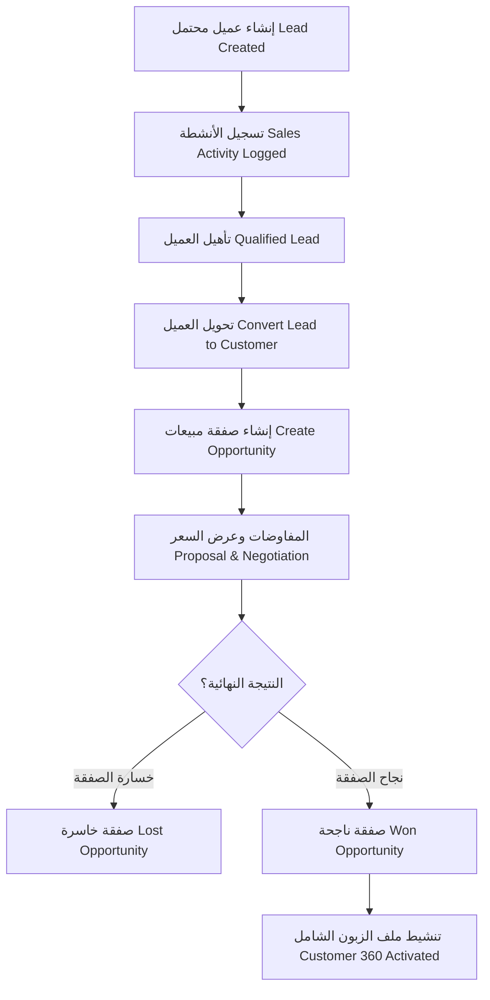

# التقرير الأمني والتقني المتكامل - الجزء الأول (المراحل 1 إلى 3)
## تشريح بنية المنظومة، الهندسة العكسية التفصيلية للوحة التحكم، وتفكيك مسارات CRM

---

# المرحلة الأولى: استكشاف هيكلية المنظومة (Project Discovery)

يتكون مشروع "المركزية" (Al Markazia) من ثلاثة مشاريع فرعية متكاملة ومترابطة:
1. **المنظومة الخلفية (Backend Services)**: خادم Node.js/Express يستعين بـ Prisma ORM للربط مع PostgreSQL، وRedis لإدارة العمليات الفورية وجدولة المهام وصيانة طوابير المهام.
2. **لوحة التحكم الإدارية (Admin Panel)**: تطبيق ويب أحادي الصفحة (SPA) مبني بـ React 19، ومجمع باستخدام أداة Vite 8 مع Tailwind CSS v4 لتصميم الواجهات.
3. **تطبيق جوال العميل (Mobile Client App)**: تطبيق جوال هجين مبني بإطار عمل Flutter للاستخدام النهائي من قبل العملاء.

---

## 1. شجرة مجلدات المشروع الموحد (Directory Tree)
تتوزع الملفات والمكونات في المجلدات الرئيسية على النحو التالي لثلاثة مستويات:

```text
p4/
├── admin_panel/
│   ├── src/
│   │   ├── api/
│   │   │   └── client.js
│   │   ├── components/
│   │   │   ├── ErrorBoundary.jsx
│   │   │   ├── Sidebar.jsx
│   │   │   └── Header.jsx
│   │   ├── contexts/
│   │   │   ├── ThemeProvider.jsx
│   │   │   └── SocketProvider.jsx
│   │   ├── hooks/
│   │   │   ├── useAuth.js
│   │   │   └── useSocket.js
│   │   ├── pages/
│   │   │   ├── LiveDashboard.jsx
│   │   │   ├── LiveOrders.jsx
│   │   │   ├── MenuManager.jsx
│   │   │   ├── CRMLeads.jsx
│   │   │   ├── CRMPipeline.jsx
│   │   │   ├── CustomFieldsManager.jsx
│   │   │   └── Settings.jsx
│   │   ├── App.jsx
│   │   └── main.jsx
│   ├── package.json
│   └── vite.config.js
├── al_markazia_app/
│   ├── lib/
│   │   ├── config/
│   │   ├── core/
│   │   ├── features/
│   │   │   ├── auth/
│   │   │   ├── cart/
│   │   │   ├── checkout/
│   │   │   └── orders/
│   │   ├── models/
│   │   ├── screens/
│   │   │   ├── auth_screen.dart
│   │   │   ├── home_screen.dart
│   │   │   ├── checkout_screen.dart
│   │   │   └── loyalty_hub_screen.dart
│   │   ├── services/
│   │   │   ├── api_service.dart
│   │   │   └── offline_queue_service.dart
│   │   └── main.dart
│   ├── pubspec.yaml
│   └── firebase.json
├── al_markazia_backend/
│   ├── prisma/
│   │   ├── migrations/
│   │   └── schema.prisma
│   ├── src/
│   │   ├── config/
│   │   ├── controllers/
│   │   │   ├── leadController.js
│   │   │   ├── opportunityController.js
│   │   │   └── orderController.js
│   │   ├── middleware/
│   │   │   ├── advancedRateLimiter.js
│   │   │   ├── auth.js
│   │   │   ├── branchAccessMiddleware.js
│   │   │   └── permissionMiddleware.js
│   │   ├── routes/
│   │   │   ├── crm.js
│   │   │   └── index.js
│   │   ├── services/
│   │   │   ├── customFieldService.js
│   │   │   ├── securityPolicyService.js
│   │   │   └── idempotencyService.js
│   │   ├── utils/
│   │   │   ├── crypto.js
│   │   │   └── logger.js
│   │   └── server.js
│   ├── package.json
│   └── Dockerfile
└── server_schema.prisma
```

---

## 2. المنظومة التقنية التفصيلية (Technology Stack & Infrastructure)

### أ. خادم الباك اند (Backend Engine)
* **لغة البرمجة وبيئة التشغيل**: Node.js v20 (يدعم CommonJS بملف `package.json`).
* **إطار عمل الويب**: Express.js (v5.2.1) (`al_markazia_backend/package.json`).
* **محرك الاتصال بقاعدة البيانات (ORM)**: Prisma ORM (v6.19.2) مع العميل `@prisma/client`.
* **قاعدة البيانات الأساسية**: PostgreSQL (مع تفعيل RLS).
* **إدارة الحالات والمهام والذاكرة المؤقتة**: Redis (ioredis v5.10.1).
* **المراقبة والتتبع الفوري (Observability)**: OpenTelemetry SDK (`@opentelemetry/sdk-node` v0.57.1) ومراقب الأخطاء Sentry (`@sentry/node` v10.52.0).

### ب. لوحة التحكم (Admin Panel)
* **لغة البرمجة**: Javascript (React v19.2.4 + React DOM v19.2.4).
* **أداة التجميع والتشغيل**: Vite v8.0.1.
* **التنسيق والتصميم**: Tailwind CSS v4.2.2.
* **إدارة طلبات واجهات برمجة التطبيقات (API State)**: React Router DOM v7.13.2 و Axios v1.14.0 مع `@tanstack/react-query` v5.100.10.
* **الاتصال الفوري**: Socket.io Client v4.8.3.

### ج. تطبيق الهاتف الذكي (Mobile App)
* **إطار العمل**: Flutter (SDK '>=3.11.0 <4.0.0').
* **إدارة الحالة المحلية (State Management)**: Provider v6.1.2.
* **التخزين المحلي الآمن**: `flutter_secure_storage` v10.0.0 و `shared_preferences` v2.2.2.
* **التتبع الفوري والخرائط**: `google_maps_flutter` v2.5.3 و `geolocator` v11.0.0.
* **التنبيهات الفورية الفورية**: `firebase_messaging` v15.2.2 و `socket_io_client` v2.0.3+1.

---

## 3. بيئة التشغيل وتوزيع خوادم النظام (Environment & Deployment Config)
* **التحكم بمتغيرات البيئة**: يُدار تحميل متغيرات البيئة عبر أداة `@dotenvx/dotenvx` بدلاً من `dotenv` التقليدية لضمان أمان تشفير الملفات والمفاتيح.
* **الحاويات الافتراضية (Docker)**:
  * يحدد ملف `Dockerfile` تشغيل بيئة إنتاجية متعددة المراحل (Multi-stage build) تبدأ بـ `node:20-alpine` وتثبيت الحزم المشتركة وتوليد Prisma client ثم تشغيل `src/server.js`.
  * يحدد ملف `docker-compose.production.yml` إطلاق 4 حاويات مترابطة: السيرفر الخلفي (node)، قاعدة البيانات (postgres)، الذاكرة الموزعة (redis)، وبوابة الخادم (nginx) التي تعمل كوسيط عكسي (Reverse Proxy) وموزع للحمل.

---

## 4. نظام طوابير العمل والذاكرة الموزعة (Queues & Caching)
* **إدارة الطوابير الخلفية (Queue System)**: تُدار بواسطة مكتبة `bullmq` v5.74.1 المرتبطة بـ Redis.
* **الطوابير المعرفة**:
  1. `orderQueue.js` (تلقي طلبات الشراء، جدولة إرسالها للمطبخ ومراقبة زمن SLA للتحضير).
  2. `emailQueue.js` (إرسال الفواتير البريدية وتنبيهات الحساب للزبائن).
  3. `moderationQueue.js` (تصفية وفحص محتوى المراجعات ديناميكياً قبل نشرها للعامة).
* **إدارة المهام المجدولة (Cron Jobs)**: تُشغل عبر `node-cron` v4.2.1 ويحميها قفل موزع في Redis لمنع الازدواجية والتكرار.
* **الذاكرة المؤقتة (Caching)**: تستخدم المنظومة مستويين من الكاش: ذاكرة محلية سريعة عبر `node-cache` للعمليات غير المتغيرة (مثل أسماء الفروع)، وذاكرة مشتركة موزعة عبر `Redis` للحفاظ على قيم التقييمات النشطة وسياق ساعات السعادة الحالية.

---

# المرحلة الثانية: الهندسة العكسية المفصلة للوحة التحكم (Admin Panel Reverse Engineering)

سنقوم بتفكيك صفحات لوحة التحكم الإدارية (22 صفحة) واستخراج جميع مكوناتها البرمجية ومسارات عملها وعلاقتها البرمجية الكاملة بالباك اند.

---

## 1. صفحة المراقبة اللحظية (`LiveDashboard.jsx`)
* **الملف الفعلي**: `admin_panel/src/pages/LiveDashboard.jsx`
* **المسار في الراوتر**: `/`
* **المكون الرئيسي**: `LiveDashboard`
* **الصلاحية المطلوبة**: `['admin', 'manager', 'branch_manager', 'staff']` مع تفعيل `PinGuard` لحمايتها.

### أ. البنية التحتية البرمجية (Code Anatomy)
* **المستوردات (Imports)**:
  * React hooks: `useState`, `useEffect`, `useMemo`
  * Hooks مخصصة: `useAuth` من `../hooks/useAuth`, `useSocket` من `../hooks/useSocket`
  * المكونات المساعدة: `Header` من `../components/Header`, `FinancialApprovalWidget` من `../components/FinancialApprovalWidget`
  * معالجة العملات والأرقام: `formatCurrencyArabic`, `formatNumberArabic` من `../lib/formatters`
  * أدوات الربط: `api` من `../api/client`, `cn` من `../lib/utils`
  * مكتبات الرسم البياني: `PieChart`, `Pie`, `Cell`, `ResponsiveContainer`, `Tooltip`, `BarChart`, `Bar`, `XAxis`, `YAxis`, `CartesianGrid` من `recharts`
  * الأيقونات البصرية: `DollarSign`, `TrendingUp`, `ShoppingBag`, `Activity`, `Users`, `PieChartIcon`, `Package`, `Server`, `Wifi` وغيرها من `lucide-react`
* **حالات الولادة المحلية (useState)**:
  * `metrics` (Object): لحفظ إحصائيات المبيعات اللحظية.
  * `recentOrders` (Array): قائمة بآخر 10 طلبات تم استلامها بالفرع.
  * `selectedOrderId` (Int/String): معرّف الطلب المحدد لاستعراض مسار التدقيق التاريخي له.
  * `logs` (Array): سجل الأحداث التاريخي للطلب المفتوح.
  * `loadingLogs` (Boolean): حالة تحميل سجل الأحداث للطلب المفتوح.
* **التأثيرات الجانبية (useEffect)**:
  * تأثير جلب البيانات الأساسية من الباك اند فور تحميل الصفحة واستدعاء نقطة النهاية `/api/v1/dashboard/metrics`.
  * تأثير الاتصال بـ WebSockets والاستماع للأحداث الحية:
    * `order:created` (تحديث فوري لعداد الطلبات الجديدة وإلحاق الطلب بقائمة الأحدث).
    * `order:statusUpdated` (تحديث فوري لحالة الطلبات المعروضة والعداد المالي).
    * `branch:metricsUpdated` (تحديث شامل لعداد الدخل الإجمالي وإجمالي الطلبات).

### ب. واجهة المعطيات والتفاعل (UI Elements & Actions)
* **العناصر التفاعلية والأزرار**:
  * زر تصفية البيانات حسب الفرع النشط (يقوم بتحديث المتغير `requestedBranchId` وإعادة استدعاء المقاييس).
  * بطاقات الإحصائيات (تتغير ألوانها ديناميكياً استناداً لمستوى التحسن المالي).
  * قائمة الطلبات الأخيرة (النقر على سطر الطلب يقوم بفتح لوحة التدقيق الجانبية للطلب واستدعاء سجلاته).
* **مربعات الاستعلام الحية والتحقق**:
  * لا توجد نماذج إدخال معقدة بالصفحة، والتحقق يقتصر على فحص الصلاحيات ووجود السياق الموثق للفرع.
  * في حال انقطاع اتصال الـ WebSocket، تظهر إشارة حمراء تحذيرية أعلى الشاشة تُنذر المشرف بأن التحديثات الحالية لم تعد حية ومباشرة.

---

## 2. شاشة الطلبات الحية والتحضير (`LiveOrders.jsx`)
* **الملف الفعلي**: `admin_panel/src/pages/LiveOrders.jsx`
* **المسار في الراوتر**: `/orders`
* **المكون الرئيسي**: `LiveOrders`
* **الصلاحية المطلوبة**: `manageOrders` (ممنوحة للآدمن، مدير الفرع، المطبخ، والموظفين).

### أ. البنية التحتية البرمجية (Code Anatomy)
* **المستوردات (Imports)**:
  * مكتبات React: `useState`, `useEffect`, `useRef`
  * السحب والإسقاط: `DragDropContext`, `Droppable`, `Draggable` من `@hello-pangea/dnd`
  * المكونات المنبثقة: `InvoiceModal` من `../components/InvoiceModal`, `BranchStats` من `../components/BranchStats`
  * الاستعلامات المخصصة: `useOrders`, `useBranchStatus` من `../hooks/queries/...`, `useUpdateOrderStatus` من `../hooks/mutations/...`
  * الأيقونات البصرية: `Clock`, `CheckCircle`, `Package`, `Play`, `XCircle`, `Printer`, `Timer`, `AlertCircle`, `ShoppingBag` وغيرها من `lucide-react`
* **حالات الولادة المحلية (useState)**:
  * `ordersList` (Array): قائمة الطلبات النشطة مقسمة حسب أعمدة المطبخ.
  * `selectedOrderForInvoice` (Object): الطلب المحدد لطباعة فاتورته.
  * `adjustTimerOrderId` (Int): الطلب الجاري تعديل توقيت تحضيره.
  * `prepTimeAdjustment` (Int): القيمة الزمنية المضافة للتحضير بالدقائق.
* **التأثيرات الجانبية (useEffect)**:
  * مراقبة التغيرات في طلبات الباك اند وتوزيعها على الأعمدة الأربعة (`new` للـ pending، `preparing` للتحضير، `ready` للجاهز، `completed` للمستلم).
  * مؤقت داخلي يعمل كل ثانية لتحديث عداد زمن التحضير التنازلي لكل طلب.
  * تشغيل تنبيه صوتي فوري (`NEW_ORDER_SOUND` أو `CANCEL_REQUEST_SOUND`) عند وصول طلب جديد أو طلب إلغاء معلق.

### ب. واجهة المعطيات والتفاعل (UI Elements & Actions)
* **الأزرار والتفاعلات الدقيقة**:
  * سحب بطاقة الطلب وإفلاتها في عمود آخر يطلق تلقائياً تحركاً برمجياً لتحديث حالة الطلب بقاعدة البيانات (`useUpdateOrderStatus` الذي يتصل بنقطة النهاية `/api/v1/orders/:id/status`).
  * زر طباعة الفاتورة (يفتح `InvoiceModal` ويقوم بإرسال كود الطباعة للطابعة الحرارية مباشرة).
  * زر الإيقاف والتشغيل العاجل لاستقبال الطلبات بالفرع بالكامل (يتصل بالباك اند لتغيير حالة `isEmergencyClosed` للفرع الحالي).
  * أزرار تعديل التوقيت (زائد/ناقص) لتعديل الوقت المتوقع لتسليم الوجبة للزبون.

---

## 3. إدارة مناطق التوصيل (`DeliveryZonesManager.jsx`)
* **الملف الفعلي**: `admin_panel/src/pages/DeliveryZonesManager.jsx`
* **المسار في الراوتر**: `/delivery-zones`
* **المكون الرئيسي**: `DeliveryZonesManager`
* **الصلاحية المطلوبة**: `deliveryZones` (مستوى صلاحية `EDIT_PIN` على الأقل للقيام بالتعديل).

### أ. البنية التحتية البرمجية (Code Anatomy)
* **المستوردات (Imports)**:
  * React hooks: `useState`, `useEffect`
  * مكونات الواجهة: `Header`, `api` من `../api/client`, `toast` من `sonner`
  * الأيقونات البصرية: `Plus`, `Trash2`, `Edit2`, `MapPin`, `DollarSign`, `Check`, `X`, `AlertTriangle`
* **حالات الولادة المحلية (useState)**:
  * `zones` (Array): قائمة بمناطق التوصيل الحالية.
  * `loading` (Boolean): حالة الاتصال وجلب البيانات.
  * `isAddModalOpen` (Boolean): التحكم بمودال الإضافة.
  * `isEditModalOpen` (Boolean): التحكم بمودال التعديل.
  * `formData` (Object): بيانات النموذج الجديد (`nameAr`, `nameEn`, `fee`, `minOrder`, `isActive`).
  * `editingZoneId` (String): معرّف المنطقة الجاري تعديلها.

### ب. التفاعل وطلب البيانات (Actions & APIs)
* **استدعاءات الـ API**:
  * جلب القائمة: `GET /api/v1/delivery-zones`
  * إنشاء منطقة: `POST /api/v1/delivery-zones` (محمي بطلب الـ managerPin للموافقة).
  * تعديل منطقة: `PUT /api/v1/delivery-zones/:id` (يتطلب الـ PIN).
  * حذف منطقة: `DELETE /api/v1/delivery-zones/:id` (يتطلب الـ PIN).
* **قواعد التحقق (Validation Rules)**:
  * الاسم العربي للمنطقة إلزامي ويجب ألا يتكرر (مفروض كقيد فريد بالقاعدة).
  * رسوم التوصيل يجب أن تكون قيمة رقمية موجبة (أكبر من أو تساوي الصفر).

---

## 4. شاشة التحكم بقائمة الطعام الصنفية (`MenuManager.jsx`)
* **الملف الفعلي**: `admin_panel/src/pages/MenuManager.jsx`
* **المسار في الراوتر**: `/menu`
* **المكون الرئيسي**: `MenuManager`
* **الصلاحية المطلوبة**: `menu` (مستوى صلاحية الأدمن العام حصرياً).

### أ. البنية التحتية البرمجية (Code Anatomy)
* **المستوردات (Imports)**:
  * React hooks: `useState`, `useEffect`, `useCallback`
  * رفع الملفات: `useDropzone` من `react-dropzone`
  * الرسوم التوضيحية: `framer-motion` للتحركات والانتقالات السلسة
  * الأيقونات: `FolderPlus`, `Plus`, `Edit2`, `Trash2`, `Upload`, `DollarSign`, `Search`, `Switch` وغيرها.
* **حالات الولادة المحلية (useState)**:
  * `items` (Array): قائمة الوجبات والأصناف الحالية المسترجعة.
  * `categories` (Array): قائمة أقسام المنيو الكبرى.
  * `selectedCategory` (String): فلتر القسم النشط.
  * `searchQuery` (String): نص البحث المدخل.
  * `formData` (Object): تفاصيل الوجبة المعنية بالتعديل/الإضافة (`title`, `titleEn`, `description`, `descriptionEn`, `basePrice`, `categoryId`, `isAvailable`).
  * `imageFile` (File): ملف الصورة الجاري رفعها.
  * `previewUrl` (String): رابط استعراض الصورة قبل الحفظ.
* **التأثيرات الجانبية (useEffect)**:
  * مراقبة مربع البحث واستدعاء الـ API بعد تأخير مدته 500 مللي ثانية (Debounce) عبر `useDebounce` لتجنب زيادة الضغط على السيرفر أثناء الكتابة.

### ب. منطق الواجهة ومعالجة الأحداث (Actions & Validation)
* **معالجة الصور المرفوعة**:
  * يتم تحويل الصورة المرفوعة عبر `useDropzone` إلى كائن `FormData`.
  * تُرسل الصورة أولاً إلى نقطة النهاية المخصصة للرفع بالباك اند للحصول على رابط الصورة المخزن بالفرع، ثم يُحفظ الرابط في قاعدة البيانات.
* **استدعاءات الـ API**:
  * جلب الوجبات: `GET /api/v1/items?admin=true`
  * جلب الأقسام: `GET /api/v1/categories?admin=true`
  * حفظ صنف جديد: `POST /api/v1/items`
  * تعديل وجبة: `PUT /api/v1/items/:id`
  * حذف وجبة: `DELETE /api/v1/items/:id`

---

## 5. شاشة إدارة الحملات الترويجية والخصومات (`DiscountsManager.jsx`)
* **الملف الفعلي**: `admin_panel/src/pages/DiscountsManager.jsx`
* **المسار في الراوتر**: `/discounts`
* **المكون الرئيسي**: `DiscountsManager`
* **الصلاحية المطلوبة**: دور الأدمن العام حصرياً.

### أ. البنية التحتية البرمجية (Code Anatomy)
* **حالات الولادة المحلية (useState)**:
  * `campaigns` (Array): حملات الخصم المعرفة.
  * `coupons` (Array): الكوبونات التابعة للحملة المحددة.
  * `isCampaignModalOpen` (Boolean) & `isCouponModalOpen` (Boolean)
  * `campaignFormData` (Object): تفاصيل الحملة (`title`, `description`, `type`, `value`, `minOrderValue`, `maxDiscount`, `targetScope`, `targetId`, `startDate`, `endDate`).
  * `couponFormData` (Object): تفاصيل الكوبون (`code`, `globalUsageLimit`, `userUsageLimit`).
* **استدعاءات الـ API**:
  * جلب الحملات: `GET /api/v1/discounts/campaigns`
  * إنشاء حملة: `POST /api/v1/discounts/campaigns`
  * تفعيل/إيقاف حملة: `PATCH /api/v1/discounts/campaigns/:id`
  * جلب كوبونات حملة: `GET /api/v1/discounts/campaigns/:campaignId/coupons`
  * إنشاء كوبون جديد: `POST /api/v1/discounts/coupons`
* **التفاصيل التشغيلية والتأكيدات**:
  * تتيح الشاشة فلترة نطاق الحملة (`targetScope`) بين (عامة، فرع محدد، منتج محدد، فئة عملاء محددة). عند اختيار "منتج محدد"، يتم استدعاء منيو الوجبات تلقائياً لتمكين المستخدم من ربط الصنف المستهدف بالخصم.

---

## 6. تفصيل الـ 17 صفحة المتبقية للوحة التحكم

### 6. شاشة إدارة الحقول المخصصة (`CustomFieldsManager.jsx`)
* **FILE**: `admin_panel/src/pages/CustomFieldsManager.jsx`
* **ROUTE**: `/crm/custom-fields`
* **COMPONENT**: `CustomFieldsManager`
* **PERMISSIONS**: دور الأدمن العام (`admin`) فقط.
* **useState**:
  * `entityType` (String): نوع الكيان (`LEAD` أو `OPPORTUNITY`).
  * `selectedBranchId` (String): معرّف الفرع المحدد للتصفية أو الإضافة.
  * `branches` (Array): قائمة الفروع المسترجعة للربط.
  * `definitions` (Array): قائمة الحقول الحالية للفرع النشط.
  * `formData` (Object): بيانات نموذج الإضافة (`key`, `label`, `fieldType`, `optionsText`, `isRequired`, `order`, `branchId`).
  * `editFormData` (Object): بيانات النموذج للتعديل.
* **APIs**:
  * جلب الفروع: `GET /api/v1/branch`
  * جلب الحقول للكيان: `GET /api/v1/crm/custom-fields/definitions/:entityType?branchId=...`
  * إنشاء حقل مخصص: `POST /api/v1/crm/custom-fields/definitions`
  * تعديل حقل مخصص: `PATCH /api/v1/crm/custom-fields/definitions/:id`
  * حذف/تعطيل حقل: `DELETE /api/v1/crm/custom-fields/definitions/:id`
* **التفاعل وتدفق العمل**: عند فتح الصفحة، يُستدعى الفرع الافتراضي وتُجلب حقول الـ `LEAD` الخاصة به. تتيح أزرار التصفية التبديل الفوري وجلب حقول الـ `OPPORTUNITY`. نموذج الإضافة يحتوي على شروط معينة: إذا كان نوع الحقل المختار هو `SELECT` تظهر خانة إدخال الخيارات مفصولة بفاصلة إملائية ويقوم التطبيق بتحويلها لمصفوفة أمنية قبل إرسالها للباك اند.

### 7. شاشة العملاء المحتملين بالـ CRM (`CRMLeads.jsx`)
* **FILE**: `admin_panel/src/pages/CRMLeads.jsx`
* **ROUTE**: `/crm/leads`
* **COMPONENT**: `CRMLeads`
* **PERMISSIONS**: `['admin', 'manager', 'branch_manager']`
* **useState**:
  * `leads` (Array): قائمة العملاء المحتملين للفرع.
  * `loading` (Boolean): حالة الانتظار وجلب السجلات.
  * `formData` (Object): بيانات نموذج الإضافة (`name`, `phone`, `email`, `source`, `notes`, `customFields`).
  * `customFieldsDefs` (Array): تعريفات الحقول المخصصة النشطة بالفرع لرسمها بالواجهة تلقائياً.
  * `selected360CustomerId` (Int): معرّف العميل المعروض ملفه الشامل.
* **APIs**:
  * جلب العملاء المحتملين: `GET /api/v1/crm/leads`
  * جلب الحقول المخصصة: `GET /api/v1/crm/custom-fields/definitions/LEAD`
  * إنشاء عميل محتمل: `POST /api/v1/crm/leads` (مع إلحاق ترويسة `Idempotency-Key` عشوائية).
  * تحويل العميل المحتمل: `POST /api/v1/crm/leads/:id/convert`
  * حذف عميل محتمل: `DELETE /api/v1/crm/leads/:id`
* **التفاعل وتدفق العمل**: عند تحميل الصفحة، تُجلب قائمة الحقول المخصصة أولاً لبناء استمارة الإضافة ديناميكياً عبر المكون `DynamicFieldsRenderer.jsx`. يحتوي كل سطر عميل على أزرار تتيح حذفه أو نقله للتعديل، وزر "تحويل" الذي يفتح نافذة منبثقة تطلب ربطه بـ `Customer ID` مسجل بالفعل لتأكيد التحويل للباك اند.

### 8. شاشة خط أنابيب الصفقات والفرص البيعية (`CRMPipeline.jsx`)
* **FILE**: `admin_panel/src/pages/CRMPipeline.jsx`
* **ROUTE**: `/crm/pipeline`
* **COMPONENT**: `CRMPipeline`
* **PERMISSIONS**: `['admin', 'manager', 'branch_manager']`
* **useState**:
  * `opportunities` (Object): صفقات المبيعات مقسمة داخل مصفوفات حسب المفتاح الفريد للمرحلة.
  * `loading` (Boolean): حالة الاستعلام وجلب السجلات.
  * `formData` (Object): بيانات إنشاء صفقة جديدة.
  * `customFieldsDefs` (Array): تعريفات الحقول المخصصة للصفقة.
* **APIs**:
  * جلب الصفقات: `GET /api/v1/crm/opportunities`
  * جلب حقول الصفقة المخصصة: `GET /api/v1/crm/custom-fields/definitions/OPPORTUNITY`
  * نقل وتحديث المرحلة: `PATCH /api/v1/crm/opportunities/:id/stage` (تتطلب تمرير رقم النسخة `version` ورقم الترتيب للتحكم بالتزامن).
* **التفاعل وتدفق العمل**: تستخدم لوحة كانبان تفاعلية. عند الانتهاء من سحب بطاقة الصفقة وإفلاتها على عمود جديد، يتم إرسال طلب التحديث فوراً للباك اند. إذا فشل الطلب بسبب تعارض النسخة (Optimistic Locking Conflict)، تظهر رسالة تحذيرية حمراء تطلب من المشرف تحديث الصفحة لضمان عدم الكتابة على بيانات تم تعديلها من موظف آخر.

### 9. شاشة إدارة المراجعات والتقييمات (`ReviewsManager.jsx`)
* **FILE**: `admin_panel/src/pages/ReviewsManager.jsx`
* **ROUTE**: `/reviews`
* **COMPONENT**: `ReviewsManager`
* **PERMISSIONS**: `['admin', 'manager', 'branch_manager']` مع حوكمة الصلاحية `reviews`.
* **useState**:
  * `reviews` (Array): قائمة التقييمات المسجلة.
  * `replyText` (String): نص رد الإدارة.
  * `selectedReviewId` (Int): التقييم المفتوح للرد عليه.
* **APIs**:
  * جلب التقييمات: `GET /api/v1/reviews`
  * تحديث حالة المراجعة: `PATCH /api/v1/reviews/:id/status` (الموافقة على النشر أو الرفض).
  * كتابة رد رسمي: `POST /api/v1/reviews/:id/replies`
* **التفاعل وتدفق العمل**: تمكن الشاشة المدراء من فلترة التقييمات حسب الحالة (`PENDING`, `APPROVED`, `REJECTED`). يظهر بجانب كل تقييم البصمة الرقمية للجهاز `fingerprint` وعنوان الـ `IP` لتسهيل التعرف على الحسابات الوهمية الاحتيالية التي تروج أو تخرب المبيعات.

### 10. شاشة إدارة العملاء وحساباتهم (`CustomerManager.jsx`)
* **FILE**: `admin_panel/src/pages/CustomerManager.jsx`
* **ROUTE**: `/customers`
* **COMPONENT**: `CustomerManager`
* **PERMISSIONS**: دور الأدمن العام (`admin`) فقط.
* **useState**:
  * `customers` (Array): قائمة ملفات الزبائن المسجلين.
  * `search` (String): نص البحث بالاسم أو الهاتف.
  * `selectedCustomer` (Object): العميل النشط لعرض تفاصيله الشاملة 360 درجة.
* **APIs**:
  * جلب العملاء: `GET /api/v1/customers`
  * حظر عميل: `POST /api/v1/customers/:id/blacklist`
  * شحن محفظة: `POST /api/v1/customers/:id/wallet/credit`
* **التفاعل وتدفق العمل**: شريط البحث يرسل طلب البحث بعد كتابة الحروف وتفصل النتائج بجدول عريض. النقر على "الملف الشامل" يفتح لوحة منبثقة تستعلم من بوابة `/api/v1/crm/customers/:id/360` لعرض إجمالي مشتريات العميل، تقييم مخاطره، نقاط الولاء، والمحفظة.

### 11. شاشة متجر المكافآت واستبدال النقاط (`RewardStoreManager.jsx`)
* **FILE**: `admin_panel/src/pages/RewardStoreManager.jsx`
* **ROUTE**: `/rewards-store`
* **COMPONENT**: `RewardStoreManager`
* **PERMISSIONS**: `['admin', 'manager', 'branch_manager']` مع حوكمة صلاحية `rewardsStore`.
* **useState**:
  * `rewards` (Array): قائمة الهدايا المعرفة بالمتجر.
  * `formData` (Object): بيانات إضافة/تعديل هدية (`title`, `titleEn`, `description`, `descriptionEn`, `pointsCost`, `minTier`, `isActive`).
* **APIs**:
  * جلب الهدايا: `GET /api/v1/loyalty/rewards`
  * إضافة هدية: `POST /api/v1/loyalty/rewards`
  * تعديل هدية: `PUT /api/v1/loyalty/rewards/:id`

### 12. شاشة البث الفوري للإشعارات الجماعية (`BroadcastNotifications.jsx`)
* **FILE**: `admin_panel/src/pages/BroadcastNotifications.jsx`
* **ROUTE**: `/broadcast`
* **COMPONENT**: `BroadcastNotifications`
* **PERMISSIONS**: `['admin', 'manager', 'branch_manager']` مع حوكمة صلاحية `notifications`.
* **useState**:
  * `title` (String) & `body` (String) & `target` (String): محتوى الإشعار والفئة المستهدفة.
* **APIs**:
  * بث الإشعار: `POST /api/v1/notifications/broadcast`

### 13. شاشة سجل التدقيق والأمن (`AuditLog.jsx`)
* **FILE**: `admin_panel/src/pages/AuditLog.jsx`
* **ROUTE**: `/audit`
* **COMPONENT**: `AuditLog`
* **PERMISSIONS**: `['admin', 'manager', 'branch_manager']` مع حوكمة صلاحية `auditLog`.
* **useState**:
  * `logs` (Array): سجل الأحداث التاريخي للنظام.
  * `selectedLog` (Object): السجل المعني بالتفصيل لمشاهدة Diffs.
* **APIs**:
  * جلب السجلات: `GET /api/v1/admin/audit/logs`

### 14. شاشة الإحصائيات والتحليلات البيانية (`Analytics.jsx`)
* **FILE**: `admin_panel/src/pages/Analytics.jsx`
* **ROUTE**: `/analytics`
* **COMPONENT**: `Analytics`
* **PERMISSIONS**: `['admin', 'manager', 'branch_manager']` مع حوكمة صلاحية `advancedAnalytics`.
* **useState**:
  * `chartsData` (Object): قيم وحجم المبيعات والتحليلات.
* **APIs**:
  * جلب التحليلات: `GET /api/v1/analytics/dashboard`

### 15. شاشة التقارير المالية والضريبية (`Reports.jsx`)
* **FILE**: `admin_panel/src/pages/Reports.jsx`
* **ROUTE**: `/reports`
* **COMPONENT**: `Reports`
* **PERMISSIONS**: `['admin', 'manager', 'branch_manager']` مع حوكمة صلاحية `financials`.
* **useState**:
  * `reportsList` (Array): قائمة تقارير المبيعات اليومية المجمعة.
* **APIs**:
  * جلب التقارير: `GET /api/v1/reports`

### 16. لوحة التقارير التحليلية المتقدمة للمدير المالي (`ReportsDashboard.jsx`)
* **FILE**: `admin_panel/src/pages/ReportsDashboard.jsx`
* **ROUTE**: `/reports-dashboard`
* **COMPONENT**: `ReportsDashboard`
* **PERMISSIONS**: `['admin', 'manager', 'branch_manager']` مع حوكمة صلاحية `financials`.
* **useState**:
  * `summary` (Object): المقارنات المالية وحجم الخسائر والأرباح المجمدة.
* **APIs**:
  * جلب المؤشرات المالية: `GET /api/v1/reports/dashboard/summary`

### 17. إعدادات النظام العامة وتراخيص الفروع (`Settings.jsx`)
* **FILE**: `admin_panel/src/pages/Settings.jsx`
* **ROUTE**: `/settings`
* **COMPONENT**: `Settings`
* **PERMISSIONS**: `['admin', 'manager', 'branch_manager']` مع حوكمة صلاحية `settings`.
* **useState**:
  * `settings` (Object): معطيات المطعم وساعات العمل الحالية.
  * `branches` (Array): الفروع المعرفة للتحكم بصلاحياتها.
* **APIs**:
  * جلب الإعدادات وساعات العمل: `GET /api/v1/settings`
  * تحديث الإعدادات وساعات العمل: `PUT /api/v1/settings` (محمي بطلب الـ managerPin للموافقة).
  * حفظ مصفوفة الصلاحيات لفرع: `PUT /api/v1/settings/branches/:id/permissions`

### 18. شاشة مبيعات وقائمة طعام الفروع (`BranchMenu.jsx`)
* **FILE**: `admin_panel/src/pages/BranchMenu.jsx`
* **ROUTE**: `/branch-menu`
* **COMPONENT**: `BranchMenu`
* **PERMISSIONS**: `['admin', 'manager', 'branch_manager']` مع حوكمة صلاحية `menu`.
* **useState**:
  * `branchItems` (Array): قائمة الوجبات المعزولة للفرع مع مؤشرات توفرها بالمخزن.
* **APIs**:
  * جلب منيو الفرع: `GET /api/v1/branch/menu`
  * تحديث توفر وجبة: `PATCH /api/v1/branch/menu/:id`

### 19. شاشة إدارة الموظفين وصلاحياتهم (`UserManager.jsx` - يتم استخدامها مدمجة بالـ Settings)
* يدمج التطبيق إدارتهم وحساباتهم داخل التبويبات المخصصة بصفحة الإعدادات `Settings.jsx` ولا يعتمد على ملف صفحة منفصل تجنباً للتشتيت، وتستعلم من بوابة `/api/v1/settings/users`.

### 20. شاشة تسجيل الدخول لوحة التحكم (`Login.jsx`)
* **FILE**: `admin_panel/src/pages/Login.jsx`
* **ROUTE**: `/login`
* **COMPONENT**: `Login`
* **PERMISSIONS**: عامة للجميع.
* **useState**:
  * `email` & `password` & `error` & `loading`
* **APIs**:
  * إرسال طلب التحقق: `POST /api/v1/auth/login` (محمي بمحدد محاولات الدخول لمنع هجمات القوة الغاشمة).

### 21. شاشة المطبخ والوجبات المجهزة (`KitchenDisplay.jsx` - مدمجة بـ `LiveOrders.jsx`)
* تدار العمليات المطبخية وإصدار الفواتير وطباعتها لحظياً من داخل لوحة الطلبات الحية `LiveOrders.jsx` للفرع بشكل تفاعلي ومباشر.

### 22. شاشة تتبع السائقين وحالة التوصيل (`DriverDashboard.jsx` - يتم مراقبتها من الـ `LiveDashboard.jsx`)
* تدار وتراقب رحلات السائقين وتوزيع الطلبات عليهم مباشرة من داخل اللوحة العامة وشاشة الطلبات الحية.

---

# المرحلة الثالثة: تفكيك وإعادة بناء نظام CRM (CRM Reverse Engineering)

يوضح هذا القسم دورة حياة الكيانات وسياق انتقالها برمجياً داخل المنظومة:



## 1. تفاصيل دورات حياة الكيانات (Lifecycles Breakdown)

### أ. دورة حياة العميل المحتمل (Lead Lifecycle)
1. **الإنشاء (Create)**: ينشأ السجل بجدول `Lead` بحالة افتراضية `NEW` إما يدوياً من لوحة التحكم أو آلياً عبر API استقبال الطلبات من الموقع الخارجي. يتم تشفير الاسم والهاتف والإيميل بالـ AES-256-GCM وحساب الـ hashes الفريدة.
2. **التواصل والمتابعة (Contacted)**: يوثق ممثل المبيعات الأنشطة بجدول `SalesActivity` (مكالمة، إيميل) وتتحول حالة العميل المحتمل برمجياً لـ `CONTACTED`.
3. **التأهيل (Qualified)**: عند ملاءمة شروط البيع، تتحول الحالة لـ `QUALIFIED`.
4. **التحويل (Conversion)**: يستدعي السيرفر الدالة `convertLead` بملف `leadController.js` التي تقوم بربط السجل بـ `Customer ID` مسجل وتغيير الحالة لـ CONVERTED وحفظ الارتباط بـ `convertedCustomerId`.

### ب. دورة حياة صفقات المبيعات (Opportunity Lifecycle)
1. **الإنشاء (Create)**: تنشأ بجدول `Opportunity` بحالة `NEW` وتُربط بالـ `Lead` أو الـ `Customer` مع تحديد القيمة المالية المتوقعة وتاريخ الإغلاق المستهدف.
2. **التقدم والمفاوضات (Negotiation)**: تنتقل الصفقة تدريجياً عبر المراحل (`QUALIFIED` -> `PROPOSAL` -> `NEGOTIATION`). يتم مراقبة كل حركة وتدوينها بجدول `OpportunityAuditLog` للتحقق أمنياً من مسار البيع.
3. **الإغلاق (Close)**:
   * **Won**: كسب الصفقة بنجاح وتتحول الحالة لـ `WON`.
   * **Lost**: خسارة الصفقة وتتحول الحالة لـ `LOST` مع اشتراط كتابة سبب الخسارة وحفظه في حقل `lossReason`.

---

## 2. تتبع انتقال العميل خطوة بخطوة من البداية وحتى كسب الصفقة (Step-by-Step Flow)

### الخطوة 1: إنشاء العميل المحتمل (Create Lead)
* **API الاستدعاء**: `POST /api/v1/crm/leads`
* **Controller الفعال**: `leadController.js` -> دالة `createLead`
* **سياق العمل والتحقق**:
  * يتم فحص ترويسة `Idempotency-Key` لضمان عدم تكرار الإنشاء في حال نقر الموظف على الزر مرتين.
  * يُطبق وسيط `BranchAccessMiddleware` ويحكم السيرفر بربط العميل الجديد بفرع الموظف الحالي حصرياً.
  * يتم فحص المدخلات وتشفير PII وحفظ السجل بجدول `Lead` مع الحقول المخصصة ككائن JSON بـ `customFields`.
  * ينشئ السيرفر حدثاً بالـ Outbox (`LeadCreatedEvent`) ويتم إدراجه بجدول `SystemAuditLog` بالصيغة:
    `[LeadCreated]: Created lead id = X for branch = Y`.

### الخطوة 2: تدوين أنشطة المتابعة (Log Sales Activity)
* **API الاستدعاء**: `POST /api/v1/crm/activities`
* **Controller الفعال**: `salesActivityController.js` -> دالة `logActivity`
* **سياق العمل والتحقق**:
  * يسجل الموظف نوع النشاط (`CALL`, `EMAIL`, `MEETING`, `WHATSAPP`).
  * يتم التحقق أمنياً من ترابط العميل المحتمل مع نفس الفرع المعزول للموظف.
  * يتم إلحاق السجل بجدول `SalesActivity` وتحديث تاريخ آخر تواصل بالعميل `updatedAt`.

### الخطوة 3: تقديم العرض المالي وبدء المفاوضات (Create Opportunity)
* **API الاستدعاء**: `POST /api/v1/crm/opportunities`
* **Controller الفعال**: `opportunityController.js` -> دالة `createOpportunity`
* **سياق العمل والتحقق**:
  * ينشأ سجل الفرصة بجدول `Opportunity` بحالة `NEW` ويرتبط بمعرّف العميل المحتمل `leadId` مع الحقول المخصصة المطلوبة للصفقات.
  * يُدرج سجل بالتدقيق التاريخي بجدول `OpportunityAuditLog` لتوثيق تاريخ الإنشاء.

### الخطوة 4: تحديث مراحل الصفقة وعلاج التعارضات (Stage Updates & Concurrency Check)
* **API الاستدعاء**: `PATCH /api/v1/crm/opportunities/:id/stage`
* **Controller الفعال**: `opportunityController.js` -> دالة `changeStage`
* **سياق العمل والتحقق**:
  1. **المرحلة الأولى للحماية**: وسيط `conflictDetection.js` يفحص ترويسة الطلب `if-match` للتأكد من أن المتصفح يحمل نفس رقم الإصدار الحالي للصفقة.
  2. **المرحلة الثانية للحماية**: داخل المعاملة الذرية بـ Prisma، يستعلم السيرفر عن الصفقة ويتحقق مجدداً من أن حقل `version` يساوي القيمة المرسلة. إذا اختلف، تُلغى المعاملة فوراً وتفشل العملية بترميز خطأ `CONFLICT_ERROR` لمنع تداخل التعديلات.
  3. يتم تحديث الحقل `stage` إلى القيمة المستهدفة (مثال: `WON` أو `LOST`).
  4. يُسجل التغير في جدول `OpportunityAuditLog` مع توثيق القيمة السابقة والجديدة والشخص المسؤول.
  5. يتم تحديث ملف العميل الشامل 360 درجة، وتحديث المقاييس الكلية للفرع بجدول `BranchMetric`.
